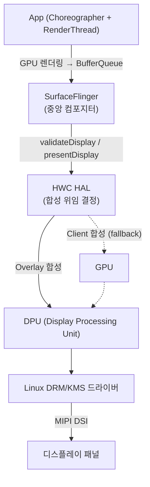

# Android 그래픽스/디스플레이 파이프라인 (SurfaceFlinger → HWC → DRM → Panel)

이 문서는 칩셋 벤더 Display/Graphics System SW 직무의 핵심인 안드로이드 디스플레이 파이프라인 전체 — 앱 렌더링부터 물리 패널 출력까지 — 의 구성 요소와 동기화 메커니즘을 정리한 지식 문서입니다.

> 관련 문서: [chipset-vendor-bsp-core](chipset-vendor-bsp-core.md)(ION/DMA-BUF), [system-debugging-profiling](system-debugging-profiling.md)(Systrace로 파이프라인 추적)

---

## 0. 전체 파이프라인 한눈에 보기

- **프레임 예산**: 60Hz = 16.6ms, 120Hz = 8.3ms. 이 안에 `앱 렌더 → 합성 → 스캔아웃`이 모두 끝나야 Jank가 없음.
- 각 단계는 **버퍼(fd) 전달 + Fence 동기화**로 연결되는 비동기 파이프라인.

## 1. SurfaceFlinger — 중앙 그래픽 컴포지터

- **역할**: 여러 앱/시스템 UI가 생산한 그래픽 버퍼(Layer)를 수집해 **하나의 화면으로 합성**하고 디스플레이로 보내는 시스템 데몬.
- **BufferQueue**: 생산자(앱 RenderThread) ↔ 소비자(SurfaceFlinger) 간 버퍼 순환 큐. `dequeue → queue → acquire → release` 4단계 상태 머신.
- **VSYNC 구동**: HW VSYNC를 기준으로 앱 렌더 타이밍(Choreographer)과 합성 타이밍을 위상 오프셋으로 분리해 파이프라이닝.
- **합성 전략 결정**: 각 Layer를 HWC(Overlay)로 보낼지, GPU(Client 합성)로 폴백할지 매 프레임 협상.

## 2. HWC (Hardware Composer HAL)

- **정의**: GPU 연산 부하를 줄이기 위해 레이어 합성을 SoC 내 **DPU(Display Processing Unit)에 직접 위임**하는 C++ HAL 모듈.
- **핵심 프로토콜** (매 프레임):
  1. `validateDisplay`: SurfaceFlinger가 레이어 목록 제시 → HWC가 각 레이어를 `DEVICE`(DPU 처리 가능) / `CLIENT`(GPU 폴백) 판정
  2. `presentDisplay`: 판정대로 합성 실행, release fence 반환
- **벤더 관점**: DPU의 하드웨어 제약(오버레이 plane 수, 스케일링 배율, 색 포맷, 회전 지원)을 HWC 정책으로 노출하는 것이 벤더 구현의 본질. Overlay 소진 시 GPU 폴백 → 전력/성능 저하 → 벤더 최적화 포인트.

## 3. Gralloc HAL — 그래픽 버퍼 할당자

- **역할**: 그래픽 버퍼의 할당/해제와 메모리 속성을 제어하는 벤더 라이브러리 (내부적으로 DMA-BUF 힙 사용).
- **Usage Flag**: `GPU_RENDER_TARGET`, `COMPOSER_OVERLAY`, `CPU_READ_OFTEN` 등 — **누가 이 버퍼를 어떻게 쓸지**를 선언하면 벤더 구현이 최적 메모리(캐시 정책, 정렬, 압축 포맷 예: AFBC)를 선택.
- **벤더 관점**: 잘못된 usage 조합 → 캐시 불일치, 밴딩, 성능 저하. 포맷 협상(pixel format ↔ DPU/GPU 지원)의 접점.

## 4. Linux DRM / KMS

- **DRM (Direct Rendering Manager)**: 커널의 GPU/디스플레이 표준 드라이버 프레임워크. 버퍼 관리(GEM/DMA-BUF)와 명령 제출 담당.
- **KMS (Kernel Mode Setting)**: 해상도/리프레시레이트/파이프라인 구성을 커널에서 설정하는 표준 인터페이스.
- **객체 모델**: `Framebuffer → Plane → CRTC → Encoder → Connector(패널)` — DPU의 하드웨어 블록을 그대로 추상화.
- **Atomic Commit**: 여러 plane/속성 변경을 하나의 트랜잭션으로 커밋 — 테어링 없는 원자적 화면 갱신. HWC의 present가 최종적으로 여기에 도달.

## 5. MIPI DSI (Display Serial Interface)

- **정의**: SoC(DPU 출력) ↔ 디스플레이 패널 간 시리얼 데이터/프레임 전송을 담당하는 물리 인터페이스 규격 (MIPI Alliance).
- **Video Mode vs Command Mode**:
  - *Video Mode*: SoC가 매 프레임 연속 스트리밍(픽셀 클럭 유지) — 일반적, 전력↑
  - *Command Mode*: 패널 내장 프레임버퍼에 변경분만 전송(TE 신호 기반) — 전력↓, 정지 화면 유리
- **디버깅 관점**: 패널이 안 켜지는 브링업 이슈의 단골 — DSI 초기화 시퀀스(DCS 커맨드), 클럭/레인 설정, TE 신호를 오실로스코프로 검증.

## 6. Sync Fence — 명시적 동기화 (Explicit Synchronization)

- **문제**: CPU, GPU, DPU가 **같은 버퍼를 비동기로** 주고받음 — GPU가 아직 그리는 중인 버퍼를 DPU가 스캔아웃하면 화면 깨짐.
- **해법**: 커널 `sync_file`(fd 기반 fence)로 "이 버퍼는 이 fence가 signal되면 읽어도 됨"을 명시적으로 전달.
  - **Acquire Fence**: 소비자에게 "생산자의 쓰기가 끝났음"을 알림 (앱 GPU 렌더 완료 → SurfaceFlinger/HWC)
  - **Release Fence**: 생산자에게 "소비자의 읽기가 끝났음"을 알림 (DPU 스캔아웃 완료 → 버퍼 재사용 가능)
- **Implicit sync와의 차이**: DMA-BUF에 암묵적으로 붙는 reservation 대신, fence fd를 **파이프라인 인자로 명시 전달** — 타이밍 제어가 정밀하고 디버깅 가능(Perfetto에서 fence 대기 시간 가시화).
- **실무 포인트**: fence 누수/미대기 → 간헐적 화면 깨짐, fence 장기 미signal → 프레임 드랍·watchdog. "어느 fence에서 몇 ms 기다렸는가"가 Jank 분석의 핵심 질문.

## 7. 60/120Hz 유지 — 병목 및 레이턴시 최적화

- **프레임 드랍(Jank) 3대 원인 지점**: ① 앱 UI 스레드/RenderThread 지연 ② SurfaceFlinger 합성 지연(GPU 폴백 과다) ③ fence 대기(파이프라인 상류 지연의 전파).
- **최적화 레버**: Overlay 활용 극대화(HWC 정책), 버퍼 트리플 버퍼링, VSYNC 위상 튜닝, GPU/DPU 클럭 DVFS 정책, 렌더 패스 축소.
- **분석 도구 연계**: [system-debugging-profiling.md](system-debugging-profiling.md)의 Systrace/Perfetto로 VSYNC 타임라인과 각 단계 소요 시간을 마이크로초 단위 추적.
