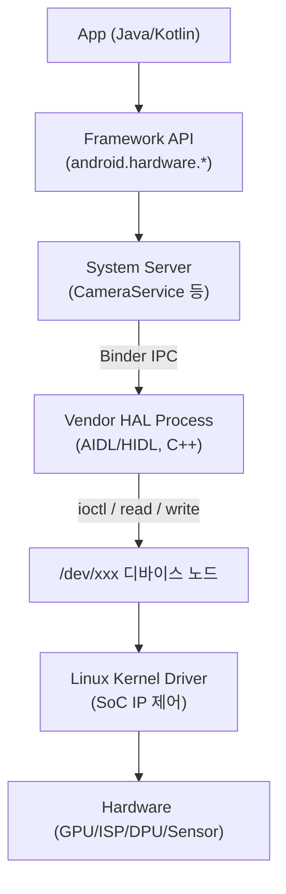

# 칩셋 벤더 플랫폼/BSP/System Software 핵심 개념

이 문서는 미디어텍, 삼성 DS(System LSI) 등 글로벌 칩셋 벤더의 플랫폼/BSP/System Software 엔지니어 직무에서 요구되는 OS 하위 레이어, 하드웨어 제어/검증, 가상화 테스트 환경의 핵심 개념을 정리한 지식 문서입니다.

> 관련 문서: [ashmem-binder-mmap](ashmem-binder-mmap.md), [aaos/hal](../aaos/hal.md), [android-graphics-display-pipeline](android-graphics-display-pipeline.md), [system-debugging-profiling](system-debugging-profiling.md)

---

## 1. 시스템 종단 간(End-to-End) 데이터 흐름: APP → 커널 드라이버

상위 Java/Kotlin 앱의 요청이 리눅스 커널 디바이스 드라이버까지 전달되는 전체 경로를 이해하는 것이 시스템 SW 엔지니어의 출발점입니다.

- **레이어별 경계**: JNI(Java↔C++), Binder(프로세스 간), 시스템 콜(유저↔커널)이라는 3개의 경계를 통과하며, 각 경계마다 컨텍스트 스위칭·직렬화 비용이 발생합니다.
- **디버깅 관점**: 장애 발생 시 "어느 경계에서 끊겼는가"를 이분 탐색하는 것이 기본 전략입니다 (logcat → binder 트랜잭션 → dmesg 순으로 하강).

## 2. Linux Kernel Driver & Device Tree

- **역할**: SoC 내부 IP 블록(GPU, Display, Camera ISP, Sensor Hub 등)을 제어하는 C 기반 커널 모듈.
- **Device Tree(DTS/DTB)**: 하드웨어 구성(주소 맵, IRQ, 클럭, 전원 도메인)을 커널 코드와 분리해 선언하는 데이터 구조. 보드 변경 시 드라이버 재컴파일 없이 DT만 수정 — BSP 이식성의 핵심.
- **주요 서브시스템**: platform driver 모델, clk/regulator framework, runtime PM(전원 관리), IRQ 처리(top/bottom half).

## 3. Android HAL (AIDL / HIDL)

- **정의**: 프레임워크와 벤더 구현을 분리하는 하드웨어 추상화 계층. Treble 이후 벤더 파티션에 격리되어 프레임워크 업데이트와 독립적으로 유지(GSI 호환).
- **진화**: Legacy(so 직접 로드) → HIDL(Treble, `.hal`) → **AIDL HAL**(현행 표준, 버전 관리 내장).
- **실무 포인트**: C++ 네이티브 모듈로 구현, Binder를 통해 프레임워크와 통신하며, `VINTF manifest`로 인터페이스 버전을 선언. 상세: [aaos/hal.md](../aaos/hal.md), [aaos/idl-neutral-interface.md](../aaos/idl-neutral-interface.md)

## 4. Android BSP (Board Support Package)

- **정의**: 타겟 SoC 보드에서 Android를 부팅시키기 위한 소프트웨어 일체 — 부트로더, 커널, 디바이스 드라이버, HAL, 보드 설정.
- **부팅 체인**: `BootROM → Preloader/SPL → Bootloader(LK/U-Boot) → Kernel → Init(rc) → Zygote → System Server`
- **보드 브링업 순서**: 전원/클럭 → 시리얼 콘솔(UART) 확보 → 스토리지/메모리 → 커널 부팅 → 디스플레이/입력 → Android 프레임워크 기동. "시리얼 콘솔 확보"가 모든 디버깅의 생명줄.

## 5. IPC & Binder

- 프레임워크 ↔ 네이티브 HAL ↔ 데몬 간 통신의 표준 메커니즘. mmap 기반 단일 복사(1-copy) 설계로 성능 확보.
- 상세 원리와 최적화는 기존 문서 참조: [ashmem-binder-mmap.md](ashmem-binder-mmap.md), [aaos/binder-vs-pipe-vs-socket.md](../aaos/binder-vs-pipe-vs-socket.md), [aaos/binder-mmap-blocking.md](../aaos/binder-mmap-blocking.md)

## 6. Memory Management: ION → DMA-BUF Heaps

- **문제**: CPU, GPU, Display(DPU), NPU, Camera ISP가 **같은 프레임 버퍼**를 각자 접근해야 함 — 복사하면 대역폭/지연 폭발.
- **해법**: 커널이 물리 연속(또는 IOMMU 매핑 가능한) 버퍼를 할당하고, **fd(파일 디스크립터)로 버퍼 핸들을 프로세스/드라이버 간 전달**하는 Zero-Copy 공유 구조.
- **진화**: ION(Android 전용, deprecated) → **DMA-BUF Heaps**(리눅스 메인라인 표준, 5.6+).
- **핵심 개념**: heap 종류(system/cma/carveout), 캐시 일관성(cache sync), IOMMU/SMMU 주소 변환, fd 기반 소유권 이전.

## 7. In-System Programming (ISP) / Bootloader Mode

- **정의**: 칩셋 부팅 초기 단계(BootROM/부트로더)에서 USB/UART 등 인터페이스로 내부 Flash/RAM에 펌웨어를 직접 다운로드·업데이트하는 제어 방식.
- **벤더별 예**: MediaTek BROM Download Mode(SP Flash Tool), Samsung Download Mode(Odin), Qualcomm EDL(9008).
- **실무 의미**: 벽돌(brick) 복구, 초기 브링업 시 이미지 플래싱, 보안 부트 체인(서명 검증)과의 관계 이해.

## 8. Serial Communication: PWM / UART / SPI / I2C

SoC ↔ 주변기기/ASIC 간 제어·데이터 신호를 주고받는 임베디드 통신 프로토콜.

| 프로토콜 | 선 수 | 속도 | 특징 | 대표 용도 |
| --- | --- | --- | --- | --- |
| UART | 2 (TX/RX) | ~수 Mbps | 비동기, 클럭 없음 | 디버그 콘솔, GPS |
| I2C | 2 (SCL/SDA) | 100k~3.4Mbps | 멀티 슬레이브, 주소 기반 | 센서, PMIC, 터치 |
| SPI | 4+ (CLK/MOSI/MISO/CS) | ~수십 Mbps | 전이중, 고속 | 디스플레이 초기화, Flash |
| PWM | 1 | - | 듀티비로 아날로그 제어 | 백라이트, 모터, 진동 |

## 9. Signal Integrity & Protocol Profiling

- **정의**: 로직 분석기, 오실로스코프 등 계측기와 스크립트를 결합해 칩셋 입출력 신호 품질과 응답 타임아웃을 검증하는 기술.
- **검증 항목**: 신호 레벨/타이밍(setup/hold), 임피던스 매칭·반사 노이즈, 프로토콜 준수 여부(ACK/NACK, CRC), 타임아웃/재시도 동작.
- **실무 연결**: SW에서 보이는 간헐적 통신 오류의 상당수는 물리 계층 문제 — 계측기로 물리 신호를 확인해 SW/HW 원인을 격리하는 능력이 벤더 엔지니어의 차별점.

## 10. 가상화 테스트 환경: QEMU & Cuttlefish

### QEMU
- 하드웨어 시스템 전체(CPU/메모리/주변장치)를 가상화하여 PC 위에서 다른 아키텍처(ARM 등)의 OS·커널을 실행하는 에뮬레이터.
- 커널 단독 디버깅(gdb stub 연결), 부트로더 개발, 크로스 아키텍처 테스트에 활용.

### Cuttlefish (CVF)
- 구글이 공식 지원하는 **가상 안드로이드 기기**(crosvm/QEMU 기반). 실물 보드 없이 전체 AOSP 빌드 → 부팅 → HAL 테스트 → 커널 디버깅 수행.
- **에뮬레이터(goldfish)와의 차이**: Cuttlefish는 실기기와 동일한 프레임워크 동작 보장을 목표로 하는 CI/검증용 — 벤더 HAL을 가상 HAL로 대체해 프레임워크 호환성을 선검증.

## 11. CTS / VTS Validation

- **CTS (Compatibility Test Suite)**: 앱 관점에서 프레임워크 API가 표준을 준수하는지 검증 — 통과해야 GMS 인증 가능.
- **VTS (Vendor Test Suite)**: **벤더 HAL/커널 인터페이스**가 Treble 규격을 준수하는지 검증. 칩셋 벤더의 BSP 릴리즈 필수 관문.
- **관계**: CTS는 "위에서 아래로", VTS는 "경계면(HAL)을 직접" 테스트. 벤더 직무에서는 VTS 실패 분석(어느 HAL 메서드가 어떤 조건에서 규격 위반인지 추적)이 일상 업무.

## 12. 콜스택 (Call Stack)

- **정의**: 함수 호출 관계와 각 프레임의 매개변수/복귀 주소를 담는 실행 정보 체계 — 크래시/행(hang)의 원인 지점을 역추적하는 기본 수단.
- **레이어별 도구**: Java(`Thread.dumpStack`, ANR trace) → JNI/Native(tombstone, `addr2line`, `ndk-stack`) → Kernel(dmesg의 panic backtrace, `ftrace`).
- **핵심 역량**: Java 스택과 네이티브 스택을 **이어 붙여** 하나의 종단 흐름으로 읽는 것 (예: ANR의 원인이 HAL의 ioctl 블로킹임을 규명).
