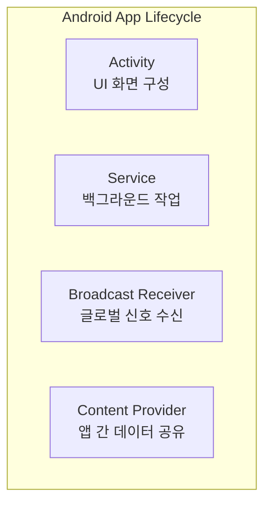
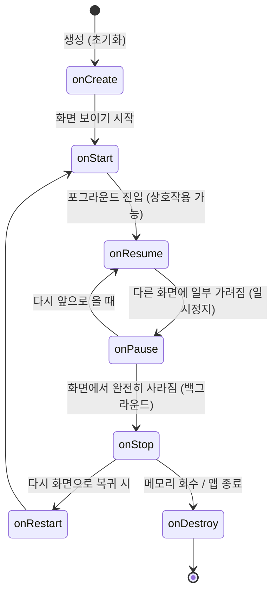

# Android 핵심 개념 및 시스템 아키텍처 가이드

이 문서는 Android 모바일 플랫폼의 기초 빌딩 블록(4대 컴포넌트), 액티비티 생명주기(Activity Lifecycle) 및 상태 전이, 그리고 컴포넌트 간 통신 수단인 Intent(명시적 vs 암시적)의 설계와 구동 사상을 정리한 지식 문서입니다.

---

## 1. Android 4대 컴포넌트 (4 Core Components)

Android 애플리케이션은 독립적인 실행 진입점을 가지는 4가지 핵심 시스템 컴포넌트로 구성됩니다. 각 컴포넌트는 `AndroidManifest.xml`에 반드시 등록되어 시스템의 관리를 받아야 합니다.



### 1.1 Activity (화면 인터랙션)
* **정의**: 사용자와 상호작용하는 시각적인 사용자 인터페이스(UI) 화면을 정의하는 가장 직관적인 컴포넌트입니다.
* **실무적 사용 흐름**:
  * **SAMF (Single Activity Multiple Fragments)**: 모던 안드로이드 앱 개발의 주류 아키텍처로, 전체 생명주기를 주관하는 단 하나의 호스트 Activity 위에 `Navigation Component`를 결합하여 다수의 Fragment들을 교체 및 주입하는 형태로 뷰 레이어를 설계합니다.
  * 액티비티를 Context의 참조 포인트로 사용하여 리소스 조회나 생명주기가 제한된 작업을 할당하고, Base ViewModel 바인딩의 생명주기 기준으로 활용됩니다.

### 1.2 Service (백그라운드 비인터랙션 연산)
* **정의**: 사용자가 UI와 직접 상호작용하지 않는 동안에도 백그라운드에서 장시간 실행되어야 하는 무거운 작업을 전담하는 컴포넌트입니다.
* **실무적 사용 흐름**:
  * 외부 하드웨어 모듈 연동(예: 블루투스 BLE 장치 연속 스캔 및 통신), 음악 재생, 실시간 위치 추적 등의 기능 단위 아키텍처를 독립적인 서비스 레이어로 분리해 백그라운드 스케줄링을 제어합니다.
  * *주의*: 서비스는 백그라운드 작업을 하지만 별도의 스레드가 아닌 메인 스레드(UI Thread)에서 동작하므로, CPU 집약적인 무거운 연산 시 서비스 내부에서 새로운 작업 스레드(Worker Thread)를 열어야 화면 버벅임이 방지됩니다.

### 1.3 Broadcast Receiver (시스템 신호 브로드캐스트 리스너)
* **정의**: Android 시스템 및 다른 앱으로부터 발송되는 다양한 브로드캐스트 이벤트 신호(배터리 부족, 네트워크 연결 변경, 부팅 완료 등)를 감지하고 반응하는 수신기입니다.
* **특징**: 화면이 없는 상태에서 동작하며 특정 이벤트가 감지되었을 때 트리거되어 Service를 실행하거나 알림(Notification)을 보내는 역할을 주로 수행합니다.

### 1.4 Content Provider (애플리케이션 간 데이터 공유 허브)
* **정의**: 자신이 소유한 앱 내부 데이터베이스(SQLite, Room 등)나 파일 시스템을 다른 앱들이 안전하게 접근 및 조작(CRUD)할 수 있도록 표준화된 데이터 연동 인터페이스를 제공하는 공급자입니다.
* **대표 예시**: 주소록 데이터(Contacts), 미디어 갤러리 파일 등에 접근하기 위해 시스템 제공 Content Provider를 호출하여 쿼리를 수행합니다.

---

## 2. Activity 생명주기 (Activity Lifecycle)

액티비티는 생성부터 소멸에 이르기까지 시스템 내부 상황과 사용자의 조작에 따라 명확하게 규정된 6단계의 상태 콜백을 거칩니다.



### 2.1 생명주기 콜백 6단계 요약

* **`onCreate()` (생성)**:
  * 액티비티가 처음 생성될 때 호출됩니다. UI 레이아웃을 설정(`setContentView`)하고 static한 초기화 작업, ViewModel 인스턴스 생성 등을 실행하는 진입점입니다.
* **`onStart()` (시작)**:
  * 액티비티가 사용자 화면에 보이기 직전에 호출됩니다. 아주 짧은 시간 동안 거쳐 가는 단계입니다.
* **`onResume()` (재개 - 상호작용)**:
  * 액티비티가 완전히 전면(Foreground)에 배치되어 **사용자와 활발히 상호작용(터치, 키 입력 등)을 할 수 있는 상태**입니다.
* **`onPause()` (일시정지)**:
  * 액티비티가 화면에는 보이지만, 다른 팝업 창, 시스템 권한 요청 다이얼로그, 또는 반투명 액티비티에 의해 **일부 가려진 상태**입니다. 포커스(Focus)만 잃었을 뿐 화면의 일부분이 표출되고 있는 상태입니다.
* **`onStop()` (정지 - 백그라운드)**:
  * 홈 버튼을 누르거나 다른 앱으로 완전히 화면이 전환되어 사용자의 시야에서 **컴포넌트가 100% 완전히 보이지 않는 백그라운드 상태**입니다.
* **`onDestroy()` (소멸)**:
  * 액티비티가 명시적으로 종료(`finish()`)되거나 화면 회전 등 구성 변경(Configuration Change)으로 인해 완전히 인스턴스가 소멸할 때 호출됩니다.

### 💡 onPause와 onStop의 핵심 시스템적 구분

| 구분 지표 | onPause() | onStop() |
| :--- | :--- | :--- |
| **화면 가시성** | 🟢 화면 일부가 사용자에게 노출됨 | 🔴 완전히 가려져 0%도 안 보임 |
| **발생 트리거** | 권한 다이얼로그, 알림 팝업, 반투명 액티비티 노출 | 홈 버튼 클릭, 다른 전체화면 앱 전환 |
| **복귀 콜백 경로**| `onResume()`으로 다이렉트 복귀 | `onRestart() ➔ onStart() ➔ onResume()` 순서로 복귀 |
| **LMK 프로세스 킬** | 🟢 킬 확률 거의 없음 (포그라운드 판정) | ⚠️ **LMK(Low Memory Killer)에 의해 강제 킬 대상 유력** |

---

## 3. Intent (컴포넌트 간 메신저)

Intent는 Android 시스템 내부에서 **컴포넌트(Activity, Service, Broadcast Receiver) 간에 어떠한 행동이나 데이터 요청을 전달하기 위해 사용되는 메시지 객체**입니다.

### 3.1 명시적 Intent (Explicit Intent)
* **동작 원리**: 이동하려는 목적지 컴포넌트의 구체적인 **클래스명(Class Type)**을 직접 코드로 선언하여 호출하는 방식입니다.
* **용도**: 주로 **동일한 애플리케이션 내부**에서 명확하게 정의된 화면(Activity) 간을 안전하게 전환하거나 데이터를 주고받을 때 사용합니다.
* **코드 예시 (Kotlin)**:
  ```kotlin
  // 목적지인 DetailActivity 클래스명을 직접 명시
  val intent = Intent(this, DetailActivity::class.java).apply {
      putExtra("itemId", 123)
  }
  startActivity(intent)
  ```

### 3.2 암시적 Intent (Implicit Intent)
* **동작 원리**: 호출할 목적지 컴포넌트를 명시하지 않고, 시스템에 수행하고자 하는 **추상적인 행동(Action)**과 전달할 **데이터의 형식(MIME Type/Uri)**만 알려주는 방식입니다.
* **용도**: **애플리케이션 외부의 다른 앱 기능**을 연동하거나 요청할 때 사용합니다. 시스템이 기기 내에 설치된 앱들의 `Intent Filter` 설정을 검사하여, 해당 Action을 정상 수행할 수 있는 앱 후보군 목록을 사용자에게 제시하고 열어 줍니다.
* **코드 예시 (Kotlin)**:
  ```kotlin
  // "전화 다이얼을 여는 행동"과 데이터 URI만 지정하여 암시적으로 요청
  val intent = Intent(Intent.ACTION_DIAL).apply {
      data = Uri.parse("tel:010-1234-5678")
  }
  startActivity(intent)
  ```
