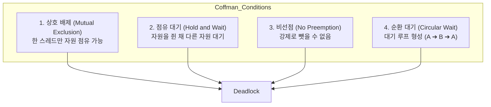

# 프로세스, 스레드 및 교착 상태 (Process, Thread, and Deadlock)

> **Context**: 운영체제(OS)의 가장 핵심적인 자원 관리 및 실행 흐름 제어 아키텍처인 프로세스(Process)와 스레드(Thread)의 물리적 차이를 규명하고, 멀티스레드 환경에서 발생할 수 있는 치명적 상태인 교착 상태(Deadlock)의 발생 조건과 예방 원리를 정리한 문서.

---

## 1. 프로세스 vs 스레드 (Process vs Thread)

프로세스와 스레드는 프로그램이 실행되는 물리적 구조와 메모리 가상화 영역의 공유 범위에 따라 나뉜다.

```
┌────────────────────────────────────────────────────────┐
│ [Process Memory Space]                                 │
│ ┌────────────────────────────────────────────────────┐ │
│ │ Code (컴파일된 기계어 코드)                        │ │
│ ├────────────────────────────────────────────────────┤ │
│ │ Data / BSS (전역 변수, 정적 변수)                  │ │
│ ├────────────────────────────────────────────────────┤ │
│ │ Heap (런타임 동적 할당 메모리)                     │ │
│ └────────────────────────────────────────────────────┘ │
│                                                        │
│ ┌────────────────────────┐  ┌────────────────────────┐ │
│ │ [Thread 1 Space]       │  │ [Thread 2 Space]       │ │
│ │ - PC (Program Counter) │  │ - PC (Program Counter) │ │
│ │ - Registers            │  │ - Registers            │ │
│ │ - Stack (지역/매개변수)│  │ - Stack (지역/매개변수)│ │
│ └────────────────────────┘  └────────────────────────┘ │
└────────────────────────────────────────────────────────┘
```

### 1) 프로세스 (Process)
- **정의**: 실행 중인 프로그램의 인스턴스로, 운영체제로부터 **독립된 메모리 영역(가상 메모리 주소 공간)**을 할당받는 자원 할당의 최소 단위.
- **메모리 구조**: 각 프로세스는 독립적인 Code, Data, Heap, Stack 영역을 보유하며, 다른 프로세스의 메모리 영역에 직접 접근할 수 없다. 접근하려면 IPC(Inter-Process Communication, 파이프, 소켓, 공유 메모리 등)가 필요하다.
- **안정성**: 하나의 프로세스가 오작동하여 강제 종료(예: Segmentation Fault)되어도 다른 프로세스의 주소 공간은 격리되어 있으므로 시스템 전체가 무너지지 않는다.

### 2) 스레드 (Thread)
- **정의**: 프로세스 내에서 동작하는 **실행 흐름의 최소 단위**.
- **메모리 구조**: 프로세스가 가진 메모리 영역 중 **Code, Data, Heap 영역을 해당 프로세스 내의 모든 스레드가 공유**한다. 단, 각 스레드는 독립적인 실행 흐름을 유지해야 하므로, 스레드 개별적으로 **Stack 영역과 CPU 레지스터(PC 포함) 세트**를 독자적으로 할당받는다.
- **안정성**: 메모리를 공유하므로, 하나의 스레드가 잘못된 메모리 주소(예: Null Pointer)에 접근해 크래시를 내면 **해당 프로세스 전체와 내부의 모든 스레드가 동시에 소멸**하는 단점이 있다.

### 3) 비교 분석 및 트레이드 오프

| 구분 | 프로세스 (Process) | 스레드 (Thread) |
|---|---|---|
| **자원 공유** | 자원을 공유하지 않음 (IPC 필요) | 프로세스의 Code/Data/Heap을 완전히 공유 |
| **생성/소멸 오버헤드** | 크다 (커널이 매번 새로운 가상 주소 테이블 할당) | 작다 (주소 공간을 새로 만들지 않고 스택만 생성) |
| **콘텍스트 스위칭 오버헤드** | **매우 큼**<br>- CPU 레지스터 저장 및 복구<br>- **MMU의 페이지 테이블 교체**<br>- **TLB(Translation Lookaside Buffer) 캐시 전체 플러시** | **상대적으로 작음**<br>- 레지스터 세트와 스택 포인터만 복구<br>- 주소 공간이 동일하여 캐시 플러시 오버헤드 없음 |
| **통신 속도** | 느림 (커널을 거치는 IPC 오버헤드) | 매우 빠름 (Heap 영역의 공유 변수로 직접 통신) |
| **동시성 버그 위험** | 없음 | Race Condition, Data Race, Deadlock의 위험 상존 |

---

## 2. 교착 상태 (Deadlock)

### 1) 정의
두 개 이상의 실행 흐름(스레드 또는 프로세스)이 서로 상대방이 가진 자원을 획득하기 위해 무한히 대기하여, 결과적으로 아무것도 진행하지 못하고 시스템이 멈춰 버리는 현상.

### 2) 데드락 발생의 4가지 필연적 조건 (Coffman Conditions)
데드락은 다음 4가지 조건이 **동시에 충족**될 때 발생한다. 즉, 이 중 단 하나라도 깨부수면 데드락은 발생하지 않는다.



#### ① 상호 배제 (Mutual Exclusion)
- **개념**: 자원은 한 번에 오직 하나의 스레드만 사용할 수 있어야 한다. 만약 여러 스레드가 동시에 쓸 수 있는 자원(예: Read-only 메모리)이라면 교착 상태가 일어나지 않는다.
- **예시**: 데이터베이스 쓰기 락(Write Lock)이나 mutex, 임계 구역(Critical Section).

#### ② 점유 대기 (Hold and Wait)
- **개념**: 최소한 하나의 자원을 점유한 채, 다른 스레드가 이미 사용 중인 추가 자원을 얻기 위해 대기하는 스레드가 존재해야 한다.
- **예시**: 스레드 A가 파일 A 리더를 쥔(Hold) 상태에서 네트워크 연결 자원(Wait)을 대기하고 있는 상황.

#### ③ 비선점 (No Preemption)
- **개념**: 다른 스레드가 임의로 자원을 점유하고 있을 때, 그 자원을 가진 스레드가 스스로 해제하기 전까지는 운영체제나 타 스레드가 강제로 자원을 빼앗을 수 없다.
- **예시**: 스레드 B가 락을 쥔 상태에서 시스템이 강제로 락을 가로채서 스레드 A에게 넘겨줄 수 없음.

#### ④ 순환 대기 (Circular Wait)
- **개념**: 대기 상태의 스레드 집합에서 각 스레드가 순환 구조로 대기하는 형태를 이루어야 한다.
  - $T_0$은 $T_1$이 가진 자원을 기다리고, $T_1$은 $T_2$가 가진 자원을 기다리며, 최종적으로 $T_n$이 $T_0$이 가진 자원을 기다리는 형태.
- **예시**:
  ```
  스레드 A (리소스 1 점유) ───대기───► 리소스 2 (스레드 B 점유)
        ▲                                   │
        └───────────────대기────────────────┘
  ```

---

## 3. 데드락 해결 기법 개요

1. **예방 (Prevention)**: 4가지 조건 중 하나를 원천적으로 제거한다.
   - 예: **순환 대기 방지**: 모든 자원에 순서(고유 번호)를 부여하고, 반드시 정해진 오름차순 번호로만 락을 획득하도록 코드를 강제한다.
2. **회피 (Avoidance)**: 자원 할당 상태를 모니터링하여 데드락 가능성이 없는 '안전 상태(Safe State)'일 때만 자원을 할당한다.
   - 예: **은행원 알고리즘 (Banker's Algorithm)**.
3. **감지 및 복구 (Detection & Recovery)**: 시스템에 데드락이 발생하는 것을 허용하되, 주기적으로 감지 알고리즘(자원 할당 그래프 등)을 돌려 데드락이 확인되면 특정 프로세스를 강제 종료하거나 자원을 선점하여 복구한다.
4. **무시 (Ignorance)**: 데드락이 드물게 발생한다고 가정하고 아무런 조치도 취하지 않는다. (현대의 대다수 범용 OS인 Windows/Linux는 성능 상의 이유로 이 방식을 취하며, 데드락이 발생하면 개발자가 재부팅하거나 프로세스를 직접 킬해야 함).
