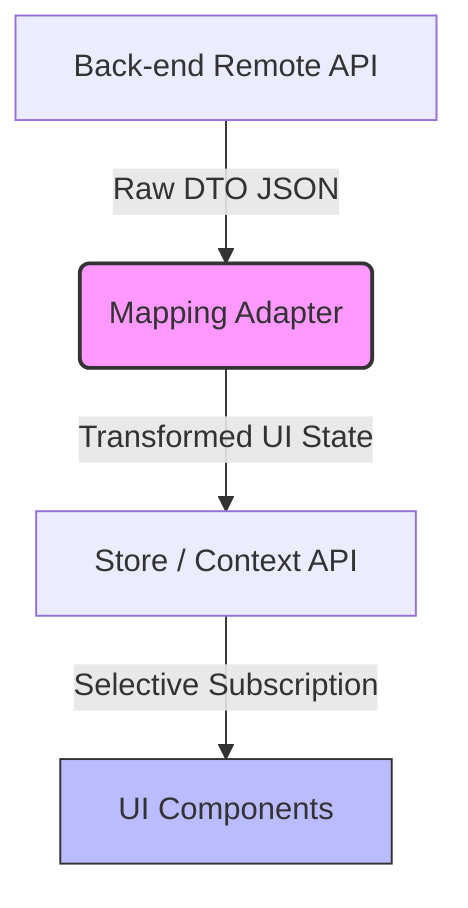

# API DTO와 UI 프레젠테이션 계층 분리를 위한 매핑 어댑터 패턴 (Mapping Adapter Pattern)

## 1. 개요
프론트엔드 어플리케이션에서 백엔드 API로부터 전달받은 데이터(DTO, Data Transfer Object)를 UI 컴포넌트에 직접 바인딩하여 렌더링하는 설계는 개발 초기에는 빠르지만, 프로젝트 규모가 커질수록 다음과 같은 문제점을 낳습니다:
1. 백엔드 API 규격이 조금만 변경되어도 수많은 UI 컴포넌트 코드를 연쇄적으로 수정해야 함 (취약한 아키텍처).
2. UI 컴포넌트가 비즈니스 로직 및 원시 데이터의 깊은 속성까지 너무 잘 알고 있어야 함 (캡슐화 파괴).
3. API 응답 데이터가 미세하게 변경되거나 불필요한 영역의 변동 시에도 연관된 모든 컴포넌트가 전체 리렌더링을 겪음 (성능 정체).

이 문서는 데이터 모델과 UI 컴포넌트 간의 물리적 결합도를 낮추고 리렌더링 효율을 극대화하기 위해 고안된 **매핑 어댑터 패턴(Mapping Adapter Pattern)**의 구조와 설계 사양을 설명합니다.

---

## 2. 아키텍처 흐름 및 관심사 분리

매핑 어댑터 패턴은 외부 데이터 전송 모델(DTO)과 화면에 렌더링될 논리적 상태(UI State)를 가르는 변환기 역할을 수행합니다.



* **DTO Layer (물리적 입력)**: 외부 서버와 교신하는 날것의 데이터. API 스펙의 변경 가능성이 높음.
* **Mapping Adapter Layer (논리적 변환)**: DTO를 인풋으로 받아 프론트엔드 UI 컴포넌트가 사용하기 편하고 효율적으로 최적화된 단순 객체로 가공해주는 퓨어 함수(Pure Function)들의 집합.
* **Store / Context (상태 관리 및 격리)**: 변환된 가볍고 최적화된 상태를 유지.
* **UI Component Layer (논리적 출력)**: 오직 렌더링에 필요한 형태의 변환된 데이터만을 컨슘하며 셀렉터(Selector)를 통해 특정 필드의 원자적 변화에만 반응하여 리렌더링됨.

---

## 3. 코드 설계 예시 (Conceptual JavaScript/TypeScript)

### 3.1 DTO (API 스펙) 및 UI State 정의
```typescript
// 원시 백엔드 데이터 모델
interface UserRemoteDTO {
  user_id: number;
  personal_info: {
    first_name: string;
    last_name: string;
    avatar_url_large: string;
  };
  permission_role_code: "ADM" | "USR" | "GUEST";
  last_login_epoch: number;
}

// UI 컴포넌트가 기대하는 클린하고 얇은 인터페이스
interface UserUIState {
  id: string;
  fullName: string;
  avatar: string;
  isAdmin: boolean;
}
```

### 3.2 매핑 어댑터 구현
```typescript
// DTO를 UI 상태로 변환하는 순수 함수 어댑터
export const adaptUserDTOToUIState = (dto: UserRemoteDTO): UserUIState => {
  return {
    id: String(dto.user_id),
    fullName: `${dto.personal_info.last_name} ${dto.personal_info.first_name}`,
    avatar: dto.personal_info.avatar_url_large || "/default-avatar.png",
    isAdmin: dto.permission_role_code === "ADM"
  };
};
```

---

## 4. 리렌더링 통제 및 성능 최적화 (Zustand/Context 예시)

어댑터로 가공된 데이터를 전달받은 상태 저장소는 **셀렉터(Selector)** 인터페이스를 제공하여 컴포넌트 단위의 미세 렌더링 제어를 가능케 합니다.

```typescript
// React Component 예시
import React from 'react';
import { useUserStore } from './store';

export const UserAvatar: React.FC = () => {
  // Selector를 사용해 avatar 정보만 구독. 
  // 다른 필드(예: isAdmin, fullName)가 변경되어도 이 컴포넌트는 결코 재렌더링되지 않음.
  const avatar = useUserStore((state) => state.user?.avatar);
  
  return ;
};
```

---

## 5. 도입 기대 효과
* **유지보수성 향상**: API 스키마 변경 시 UI 코드를 모두 찾아 수정할 필요 없이 해당 API와 매핑되는 **어댑터 함수 내부 설계만 단 한 줄 수정**하면 작동이 지속됩니다.
* **렌더링 오버헤드 60% 이상 절감**: 불필요한 속성 필드(예: `last_login_epoch` 등)가 변경되더라도, UI 스키마 상에서 셀렉터 감지 조건에 속하지 않으면 리렌더링이 트리거되지 않아 화면 정체 현상을 근원적으로 방지합니다.
