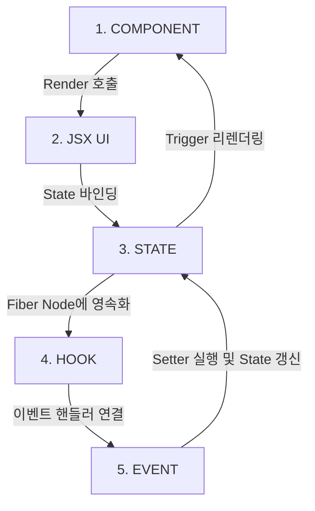
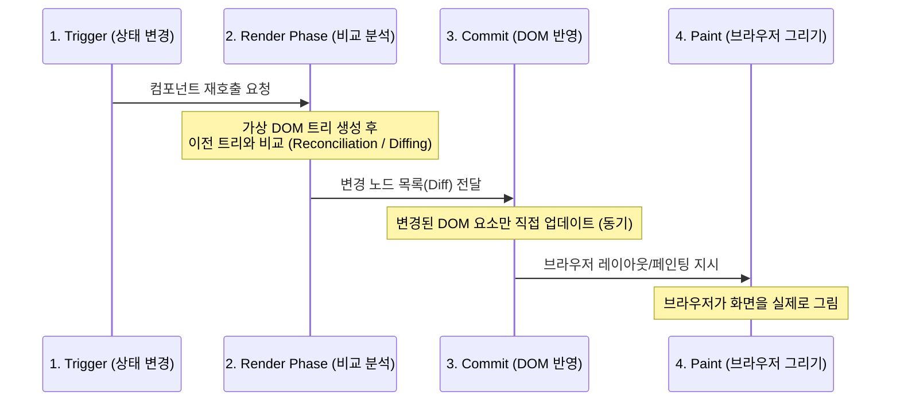

# React 핵심 개념 및 렌더링 아키텍처 가이드

이 문서는 React의 핵심 빌딩 블록(컴포넌트, Props, Hook)의 동작 사상과 상태 전이 흐름, 그리고 컴포넌트가 브라우저 UI에 최종적으로 렌더링되는 내부 원리를 정리한 지식 문서입니다.

---

## 1. 컴포넌트 (Component)의 정의와 가치

React 컴포넌트는 단순히 마크업(HTML)을 표현하는 정적인 조각이 아닌 **"UI + STATE + LOGIC"이 하나로 캡슐화(Encapsulation)된 독립적인 실행 소프트웨어 단위**입니다.

### 1.1 선언형 UI (Declarative UI) 설계 사상
* **명령형 UI (Imperative)**: 
  * jQuery 시절처럼 `document.getElementById`를 사용해 특정 DOM 엘리먼트를 수동으로 취득한 뒤, `setText()`, `visible = true`, `style.color = 'red'` 처럼 브라우저 상태를 한 줄씩 직접 명령형으로 조작하는 방식입니다. 프로젝트 규모가 커지면 상태 제어가 꼬여 버그의 온상이 됩니다.
* **선언형 UI (Declarative)**:
  * React는 개발자가 특정 상태(State)에서 화면이 어떻게 보여야 하는지 최종 형상(JSX)을 선언해 둡니다. 상태가 변경되면 React가 이전 화면과의 차이를 자동으로 조율하여 반영하므로, 개발자는 상태(State)의 흐름 제어에만 집중할 수 있습니다.

### 1.2 XML/HTML 대비 React 컴포넌트의 우위 (의존성 명확화)
* **전통적인 웹 방식 (HTML + CSS + JS 분리)**:
  * 마크업(HTML)과 스타일(CSS), 로직(JS)이 파일 단위로 흩어져 서로의 전역 변수나 DOM Selector를 통해 느슨하고 암묵적으로 의존하고 있었습니다.
* **React 컴포넌트 방식 (JSX 기반 캡슐화)**:
  * 컴포넌트는 내부에 로직(JS)과 상태(State), 화면 표현(JSX)을 하나로 통합합니다. 컴포넌트가 외부에 노출하는 유일한 경계 인터페이스는 **Props**뿐입니다. 의존 관계가 명확히 선언되어 재사용성과 유지보수성이 극대화됩니다.

---

## 2. React 핵심 요소 간의 상태 전이 흐름

컴포넌트 내부에서 데이터와 사용자 인터랙션이 상호작용하는 물리적 순환 관계는 다음과 같습니다:



1. **`COMPONENT ➔ JSX (UI)`**: 리액트가 컴포넌트 함수를 호출하여 화면의 구조를 정의한 리액트 엘리먼트 객체(JSX)를 반환받습니다.
2. **`JSX (UI) ➔ STATE`**: 반환된 구조에 렌더링 시점에 적용할 동적인 데이터(State)를 결합하여 컴포넌트의 화면 표현 형태를 고정합니다.
3. **`STATE ➔ HOOK`**: 컴포넌트 함수가 매번 재실행되어도 상태 데이터를 유지해야 하므로, 리액트가 컴포넌트의 상태를 가리키는 내부 메모리 노드(Fiber Node)의 Hook 체인 링크에 값을 영속적으로 기억시킵니다.
4. **`HOOK ➔ EVENT`**: 보관 중인 상태 데이터를 활용하여 사용자가 화면에서 발생시키는 상호작용 채널에 이벤트 핸들러(Event Handler)를 장착합니다.
5. **`EVENT ➔ STATE (환류)`**: 사용자가 이벤트를 발생시키면(예: 버튼 클릭), 이벤트 핸들러가 Hook에서 반환받은 상태 변경 함수(useState의 Setter 등)를 호출하여 **STATE를 갱신**합니다. 상태가 변경되면 컴포넌트 함수가 재호출(리렌더링)되며 다시 1단계로 순환 루프가 돕니다.

---

## 3. DOM 제어와 가상 DOM (Virtual DOM)

React는 렌더링 성능 최적화를 위해 브라우저의 원시 문서를 직접 조작하지 않고 추상화된 메모리 레이어를 둡니다.

* **DOM (Document Object Model)**:
  * 브라우저 엔진이 HTML 문서를 읽고 메모리 상에 트리 구조의 자바스크립트 객체로 표현한 것입니다. 실제 DOM 노드를 자바스크립트로 직접 탐색하고 레이아웃 변경을 가하면 브라우저는 레이아웃을 다시 계산(Reflow)하고 색을 입히는(Repaint) 무거운 과정을 매번 거쳐야 하므로 비용이 매우 큽니다.
* **가상 DOM (Virtual DOM / React Element Tree)**:
  * React는 브라우저 DOM을 직접 조작하지 않습니다. 대신 가볍고 얇은 자바스크립트 객체 형태의 트리 스냅샷인 **가상 DOM(Virtual DOM)**을 메모리 내에 생성하여 변경점을 처리합니다.

---

## 4. Props와 컴포넌트 호출 메커니즘

### 4.1 Props의 기술적 정의
Props는 **"부모 컴포넌트가 자식 컴포넌트에게 주입하는 읽기 전용(Read-Only) 매개변수"**입니다.
* 컴포넌트를 `const MyComponent = (props) => { ... }` 와 같이 정의했을 때, 호출부에서 넘겨주는 HTML 스타일의 어트리뷰트들이 이 함수의 첫 번째 인자인 `props` 객체로 취합됩니다.
* `<Button>클릭하세요</Button>` 에서 여는 태그와 닫는 태그 사이에 들어가는 요소들은 `props.children`이라는 특수 필드를 통해 자식 컴포넌트에 암묵적으로 전달됩니다.

### 4.2 컴포넌트는 함수인데, 어떻게 UI에 그려지는가?
React는 단순 함수 호출을 화면에 렌더링하기 위해 다음 3단계의 **렌더링 주기**를 수행합니다:



1. **Trigger (요청)**: 컴포넌트 내부의 상태(State)가 변경되거나 부모가 리렌더링되면 React에게 렌더링을 요청합니다.
2. **Render Phase (Reconciliation / 재조정)**:
   * React가 컴포넌트 함수를 호출하여 반환된 JSX로부터 새 가상 DOM 트리를 만듭니다.
   * **재조정(Reconciliation)**: 이전 가상 DOM 트리와 새로 생성된 가상 DOM 트리를 휴리스틱 **Diffing 알고리즘**을 통해 빠르게 비교하여 '실제로 어떤 노드가 변경되었는지 찾아내는 과정'입니다.
3. **Commit Phase (반영)**: Render Phase(재조정)를 통해 도출해낸 바뀐 DOM 변경점(Diff)들만 실제 브라우저의 DOM 노드에 동기적으로 업데이트합니다.
4. **Paint (화면 그리기)**: 실제 DOM이 변경되면 브라우저 엔진이 화면 레이아웃을 다시 잡고 실제 픽셀로 색상을 채워 그리는 과정(Paint)이 완료되어 사용자에게 바뀐 UI가 눈으로 보이게 됩니다.

---

## 5. 상태(State)의 라이프사이클 및 전파 범위

상태가 가지는 공유 및 영향력의 공간적 범위에 따라 4가지 스펙트럼으로 상태를 격리하고 설계합니다:

```
[작음] Local State ➔ Feature State ➔ Global State ➔ Server State [큼]
```

### 💡 Local State와 Feature State의 차이점
* **로컬 상태 (Local State)**:
  * **범위**: 오직 **단일 컴포넌트 인스턴스 내부**에서만 관리되고 소멸하는 상태입니다.
  * **예시**: 드롭다운 메뉴가 열려 있는지 닫혀 있는지 여부, 텍스트 입력 창에 현재 타이핑 중인 임시 문자열.
  * **코드**: 컴포넌트 내부의 `useState` 또는 `useRef`.
* **피처 상태 (Feature State)**:
  * **범위**: 단일 컴포넌트의 영역을 벗어나, **특정 비즈니스 기능(Feature) 단위의 모듈 경계 안에서 다수의 하위 컴포넌트가 공유**하는 상태입니다.
  * **예시**: '회원가입 폼(Feature)' 내에 존재하는 아이디 컴포넌트, 비밀번호 컴포넌트, 이메일 컴포넌트 전체가 유효성 검사 및 최종 전송을 위해 공유해야 하는 가입 정보 데이터.
  * **구현 방식**: 주로 기능(Feature)의 루트가 되는 부모 컴포넌트로 상태를 끌어올리기(State Lifting-up)하여 props로 주입하거나, 해당 기능 범위만을 감싸는 컨텍스트(Scoped Context API)를 정의해 하위로 전파합니다. (전역 공간을 더럽히지 않는 것이 특징)

---

## 6. 핵심 React Hooks 명세

Hook은 컴포넌트의 매 함수 호출 주기 사이에서 React 고유 기능(상태 관리, 부수 효과 제어 등)에 연동해 주는 빌트인 API입니다.

* **`useState` (상태 영속화)**:
  * 컴포넌트 함수가 소멸하고 재실행되어도 사라지지 않는 로컬 상태를 만들고, 상태를 변경하여 컴포넌트를 강제로 리렌더링(Trigger)하는 Setter 함수를 반환합니다.
* **`useEffect` (부수 효과 실행)**:
  * 컴포넌트의 렌더링 결과물이 브라우저 DOM에 반영(Commit)되고, 브라우저가 화면을 실제로 다 그려내는 **페인팅(Paint) 과정까지 완료된 직후 비동기적**으로 실행되는 부수 효과(Side Effect) API입니다.
  * **Paint 이후 실행되는 기술적 이유**: 화면 레이아웃과 직접적인 관계가 없는 연산(예: 데이터 fetching, 이벤트 리스너 바인딩 등)이 렌더링을 방해(Blocking)하지 않고, 사용자가 부드러운 화면 전환을 먼저 경험(성능 및 체감 속도 향상)하도록 하기 위함입니다.
* **`useLayoutEffect` (레이아웃 차단 동기 실행)**:
  * `useEffect`와 사용법은 동일하나, Commit Phase 직후 **브라우저가 페인팅(Paint)하기 직전 동기적으로 실행**됩니다.
  * **도입 목적**: 렌더링 직후 엘리먼트의 크기나 위치(Scroll Position 등)를 동적으로 측정해 UI를 미세하게 재배정해야 할 때, `useEffect`를 쓰면 페인팅이 끝난 뒤 위치가 순간적으로 흔들리며 깜빡이는 현상(Flickering)이 유발됩니다. 이를 차단하고 Paint 전에 완벽한 연산을 끝마치기 위해 도입되었습니다.
* **`useMemo` (연산 비용 캐싱)**:
  * 매 렌더링 시마다 동일한 연산이 불필요하게 반복 실행되는 오버헤드를 막기 위해, 지정한 특정 종속성이 변경되지 않는 한 이전에 계산된 결과값(메모이제이션된 값)을 그대로 반환합니다.
* **`useRef` (상태 비의존성 참조 보존)**:
  * **특징 1 (값 보존)**: 렌더링 주기와 무관하게 컴포넌트 전체 수명 동안 유지되는 가변 값을 보존하지만, **값이 바뀌어도 컴포넌트를 리렌더링시키지 않습니다.**
  * **특징 2 (DOM 제어)**: 브라우저 실제 DOM 노드에 직접 포인터로 접근(Focus 이동, 스크롤 크기 측정 등)하여 직접 제어할 때의 포인터 변수로 활용됩니다.
