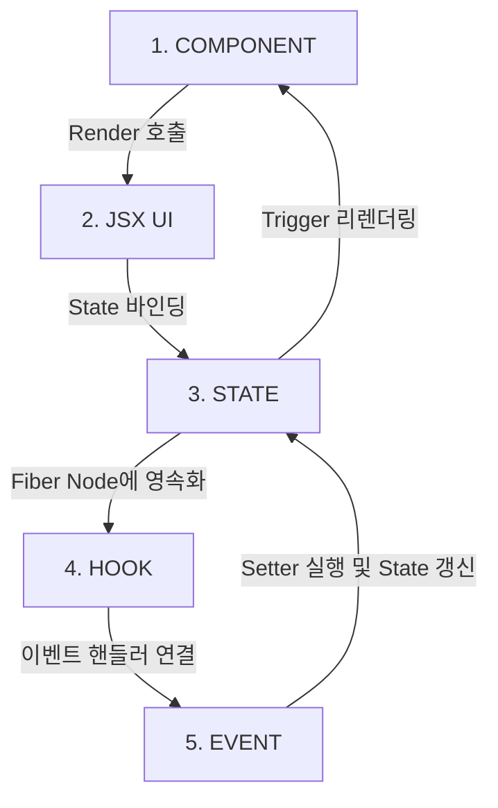
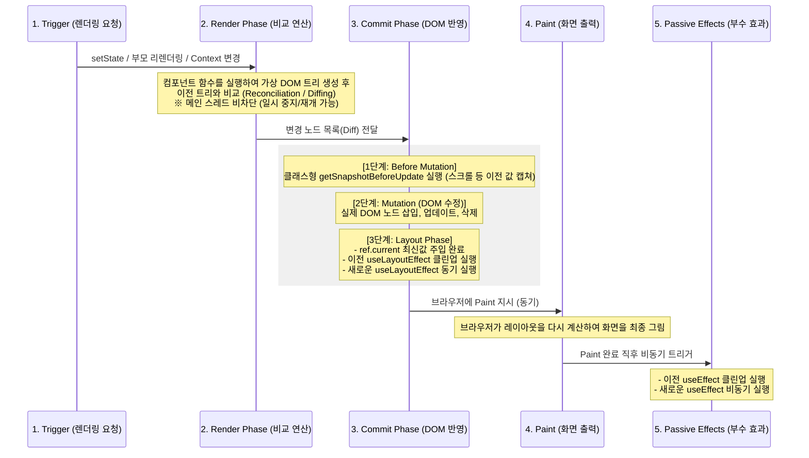

# React 핵심 개념 및 렌더링 아키텍처 가이드

이 문서는 React의 핵심 빌딩 블록(컴포넌트, Props, Hook)의 동작 사상과 상태 전이 흐름, 그리고 컴포넌트가 브라우저 UI에 최종적으로 렌더링되는 내부 원리를 정리한 지식 문서입니다.

---

## 1. 컴포넌트 (Component)의 정의와 가치

React 컴포넌트는 단순히 마크업(HTML)을 표현하는 정적인 조각이 아닌 **"UI + STATE + LOGIC"이 하나로 캡슐화(Encapsulation)된 독립적인 실행 소프트웨어 단위**입니다.

### 1.1 선언형 UI (Declarative UI) 설계 사상
* **명령형 UI (Imperative)**: 
  * jQuery 시절처럼 `document.getElementById`를 사용해 특정 DOM 엘리먼트를 수동으로 취득한 뒤, `setText()`, `visible = true`, `style.color = 'red'` 처럼 브라우저 상태를 한 줄씩 직접 명령형으로 조작하는 방식입니다. 프로젝트 규모가 커지면 상태 제어가 꼬여 버그의 온상이 됩니다.
* **선언형 UI (Declarative)**:
  * React는 개발자가 특정 상태(State)에서 화면이 어떻게 보여야 하는지 최종 형상(JSX)을 선언해 둡니다. 상태가 변경되면 React가 이전 화면과의 차이를 자동으로 조율하여 반영하므로, 개발자는 상태(State)의 흐름 제어에만 집중할 수 있습니다.

### 1.2 XML/HTML 대비 React 컴포넌트의 우위 (의존성 명확화)
* **전통적인 웹 방식 (HTML + CSS + JS 분리)**:
  * 마크업(HTML)과 스타일(CSS), 로직(JS)이 파일 단위로 흩어져 서로의 전역 변수나 DOM Selector를 통해 느슨하고 암묵적으로 의존하고 있었습니다.
* **React 컴포넌트 방식 (JSX 기반 캡슐화)**:
  * 컴포넌트는 내부에 로직(JS)과 상태(State), 화면 표현(JSX)을 하나로 통합합니다. 컴포넌트가 외부에 노출하는 유일한 경계 인터페이스는 **Props**뿐입니다. 의존 관계가 명확히 선언되어 재사용성과 유지보수성이 극대화됩니다.

---

## 2. React 핵심 요소 간의 상태 전이 흐름

컴포넌트 내부에서 데이터와 사용자 인터랙션이 상호작용하는 물리적 순환 관계는 다음과 같습니다:



1. **`COMPONENT ➔ JSX (UI)`**: 리액트가 컴포넌트 함수를 호출하여 화면의 구조를 정의한 리액트 엘리먼트 객체(JSX)를 반환받습니다.
2. **`JSX (UI) ➔ STATE`**: 반환된 구조에 렌더링 시점에 적용할 동적인 데이터(State)를 결합하여 컴포넌트의 화면 표현 형태를 고정합니다.
3. **`STATE ➔ HOOK`**: 컴포넌트 함수가 매번 재실행되어도 상태 데이터를 유지해야 하므로, 리액트가 컴포넌트의 상태를 가리키는 내부 메모리 노드(Fiber Node)의 Hook 체인 링크에 값을 영속적으로 기억시킵니다.
4. **`HOOK ➔ EVENT`**: 보관 중인 상태 데이터를 활용하여 사용자가 화면에서 발생시키는 상호작용 채널에 이벤트 핸들러(Event Handler)를 장착합니다.
5. **`EVENT ➔ STATE (환류)`**: 사용자가 이벤트를 발생시키면(예: 버튼 클릭), 이벤트 핸들러가 Hook에서 반환받은 상태 변경 함수(useState의 Setter 등)를 호출하여 **STATE를 갱신**합니다. 상태가 변경되면 컴포넌트 함수가 재호출(리렌더링)되며 다시 1단계로 순환 루프가 돕니다.

---

## 3. DOM 제어, 가상 DOM (Virtual DOM) 및 Fiber 아키텍처

React는 렌더링 성능 최적화와 화면 업데이트의 유연성을 위해 브라우저의 원시 문서를 직접 조작하지 않고 추상화된 메모리 레이어와 작업 스케줄링 엔진을 둡니다.

* **DOM (Document Object Model)**:
  * 브라우저 엔진이 HTML 문서를 읽고 메모리 상에 트리 구조의 자바스크립트 객체로 표현한 것입니다. 실제 DOM 노드를 자바스크립트로 직접 탐색하고 레이아웃 변경을 가하면 브라우저는 레이아웃을 다시 계산(Reflow)하고 색을 입히는(Repaint) 무거운 과정을 매번 거쳐야 하므로 비용이 매우 큽니다.
* **가상 DOM (Virtual DOM / React Element Tree)**:
  * React는 브라우저 DOM을 직접 조작하지 않습니다. 대신 가볍고 얇은 자바스크립트 객체 형태의 트리 스냅샷인 **가상 DOM(Virtual DOM)**을 메모리 내에 생성하여 변경점을 처리합니다.

### 3.1 React Fiber 아키텍처와 Fiber Node (핵심 재조정 엔진)
* **Fiber의 정의**:
  * **React Fiber**는 리액트 16 버전에서 도입된 새로운 재조정(Reconciliation) 엔진이자, 컴포넌트 트리 내의 각 컴포넌트 상태와 렌더링 작업을 관리하는 **리액트 내부의 가상 Stack Frame(작업 단위 메타데이터 객체)**입니다.
* **태동 배경 (Stack Reconciler의 한계 극복)**:
  * 리액트 15 이전의 Stack Reconciler는 브라우저의 JS Call Stack에 렌더링 작업을 동기식으로 쌓아 처리했습니다. 트리가 거대할 경우 렌더링 작업이 메인 스레드를 독점하여 애니메이션 프레임이 밀리거나 사용자 입력이 먹통이 되는 **화면 버벅임(Jank)** 현상이 발생했습니다.
  * Fiber는 작업을 여러 조각으로 쪼개어 스케줄링할 수 있는 **가상 Stack Frame**으로 고안되었습니다. 덕분에 렌더링 연산 도중 사용자 입력 등 우선순위가 높은 태스크가 들어오면 **렌더링을 일시 중단(Pause)하고 높은 우선순위 작업을 먼저 처리한 뒤 멈춘 지점부터 재개(Resume)하거나 폐기(Abort)**하는 **동시성 렌더링(Concurrent Rendering)**이 가능해졌습니다.
* **함수형 컴포넌트의 상태 보존**:
  * 클래스형 컴포넌트는 인스턴스 자체(`this`)가 메모리에 상주하며 상태를 보관했습니다. 반면 함수형 컴포넌트는 단순 함수 호출이므로 렌더링마다 함수가 재실행되어 로컬 변수가 소멸합니다.
  * 리액트는 함수형 컴포넌트와 1:1로 매핑되는 **Fiber Node**를 메모리에 유지합니다. `useState` 등의 훅을 통해 생성된 상태 정보는 바로 이 Fiber Node 내부의 `memoizedState` 필드에 **단방향 연결 리스트(Linked List)** 형태로 체이닝되어 영속적으로 보존됩니다.

### 3.2 Fiber 트리의 더블 버퍼링 (Double Buffering) 메커니즘
화면 갱신 과정에서 깜빡임이나 불완전한 상태 렌더링을 완전히 방지하기 위해 React는 메모리 상에 두 종류의 Fiber 트리를 유지합니다:
1. **`current` 트리**: 현재 브라우저 화면에 실물로 그려져 표출되고 있는 파이버 트리.
2. **`workInProgress` 트리**: 상태 변화가 감지되어 다음 화면을 만들기 위해 메모리 상에서 조용히 빌드(Render Phase) 중인 파이버 트리.
* `workInProgress` 트리의 가상 DOM 재조정 및 연산이 완벽히 끝나면, 리액트는 단지 **포인터(Pointer)**만 변경하여 순식간에 화면을 교체(Commit & Paint)합니다. 이 방식을 컴퓨터 그래픽스 분야의 **더블 버퍼링(Double Buffering)** 기법이라 부릅니다.

---

## 4. Props와 컴포넌트 호출 메커니즘

### 4.1 Props의 기술적 정의
Props는 **"부모 컴포넌트가 자식 컴포넌트에게 주입하는 읽기 전용(Read-Only) 매개변수"**입니다.
* 컴포넌트를 `const MyComponent = (props) => { ... }` 와 같이 정의했을 때, 호출부에서 넘겨주는 HTML 스타일의 어트리뷰트들이 이 함수의 첫 번째 인자인 `props` 객체로 취합됩니다.
* `<Button>클릭하세요</Button>` 에서 여는 태그와 닫는 태그 사이에 들어가는 요소들은 `props.children`이라는 특수 필드를 통해 자식 컴포넌트에 암묵적으로 전달됩니다.

### 4.2 컴포넌트가 UI에 그려지는 전체 수명주기 흐름
React는 단순 함수 호출을 브라우저 화면에 반영하기 위해 다음 5단계의 **렌더링 라이프사이클**을 수행합니다:



1. **Trigger (렌더링 요청)**:
   * 컴포넌트 내부 상태 갱신(`setState`), 부모 컴포넌트의 리렌더링, 혹은 구독 중인 `Context` 값의 변경에 의해 렌더링이 트리거됩니다.
2. **Render Phase (Reconciliation / 재조정)**:
   * React가 컴포넌트 함수를 호출하여 새 가상 DOM 트리를 만듭니다.
   * **재조정(Reconciliation)**: 이전 가상 DOM 트리와 새 가상 DOM 트리를 비교하여 변경점을 탐색하는 과정입니다.
   * 이 단계는 순수 연산 단계이므로 메인 스레드를 블로킹하지 않고 필요에 따라 중단(Pause), 재개(Resume), 폐기(Abort)가 가능합니다.
3. **Commit Phase (실제 DOM 반영)**:
   * Render Phase의 가상 DOM 연산 결과를 실제 DOM에 일괄 반영하는 단계이며, 중단 없이 **동기적**으로 실행됩니다.
   * **Before Mutation**: 실제 DOM이 수정되기 바로 직전 단계로, `getSnapshotBeforeUpdate` 등이 호출되어 수정 전의 DOM 속성(예: 현재 스크롤 위치)을 캡쳐합니다.
   * **Mutation**: 실제 브라우저 DOM 노드를 추가, 수정, 삭제합니다.
   * **Layout Phase**: DOM 변경이 끝난 직후 단계로, `ref` 객체의 `.current` 값 업데이트가 이 시점에 완결됩니다. 이어서 이전 `useLayoutEffect`의 클린업 함수가 가동된 후, 새로운 `useLayoutEffect`가 동기적으로 즉시 실행됩니다.
4. **Paint (브라우저 그리기)**:
   * 실제 DOM 변경점에 맞추어 브라우저 엔진이 레이아웃을 재계산(Reflow)하고 최종 픽셀을 화면에 입혀 그립니다(Paint).
5. **Passive Effects Phase (Paint 이후)**:
   * 브라우저 페인팅까지 안전하게 완료된 이후, 이전 `useEffect`의 클린업 함수가 차례대로 실행된 후, 새로운 `useEffect` 함수들이 비동기적으로 실행됩니다.

---

## 5. 상태(State)의 라이프사이클 및 전파 범위

상태가 가지는 공유 및 영향력의 공간적 범위에 따라 4가지 스펙트럼으로 상태를 격리하고 설계합니다:

```
[작음] Local State ➔ Feature State ➔ Global State ➔ Server State [큼]
```

### 💡 Local State와 Feature State의 차이점
* **로컬 상태 (Local State)**:
  * **범위**: 오직 **단일 컴포넌트 인스턴스 내부**에서만 관리되고 소멸하는 상태입니다.
  * **예시**: 드롭다운 메뉴가 열려 있는지 닫혀 있는지 여부, 텍스트 입력 창에 현재 타이핑 중인 임시 문자열.
  * **코드**: 컴포넌트 내부의 `useState` 또는 `useRef`.
* **피처 상태 (Feature State)**:
  * **범위**: 단일 컴포넌트의 영역을 벗어나, **특정 비즈니스 기능(Feature) 단위의 모듈 경계 안에서 다수의 하위 컴포넌트가 공유**하는 상태입니다.
  * **예시**: '회원가입 폼(Feature)' 내에 존재하는 아이디 컴포넌트, 비밀번호 컴포넌트, 이메일 컴포넌트 전체가 유효성 검사 및 최종 전송을 위해 공유해야 하는 가입 정보 데이터.
  * **구현 방식**: 주로 기능(Feature)의 루트가 되는 부모 컴포넌트로 상태를 끌어올리기(State Lifting-up)하여 props로 주입하거나, 해당 기능 범위만을 감싸는 컨텍스트(Scoped Context API)를 정의해 하위로 전파합니다. (전역 공간을 더럽히지 않는 것이 특징)

---

## 6. 핵심 React Hooks 명세

Hook은 컴포넌트의 매 함수 호출 주기 사이에서 React 고유 기능(상태 관리, 부수 효과 제어 등)에 연동해 주는 빌트인 API입니다.

### 6.1 React 내장 Hook 전체 요약표

| 분류 | Hook | 핵심 기능 | 비고 (작동 조건 및 용도) |
|:---|:---|:---|:---|
| **상태 관련** | `useState` | 로컬 상태를 보존하고 상태 갱신 시 리렌더링 트리거 | 가장 기본적인 로컬 상태 관리 훅 |
| | `useReducer` | 복잡한 로컬 상태 로직을 Reducer 함수(Redux 패턴)로 위임하여 관리 | 다차원 상태 및 대규모 복잡성 제어용 |
| | `useRef` | 렌더링을 유발하지 않는 가변 값 기억 + 브라우저 DOM 노드 직접 참조 | 값의 지속성 및 DOM 제어 전용 |
| **사이드 이펙트** | `useEffect` | 화면 렌더링(Paint) 완료 후 비동기적으로 사이드 이펙트 실행 | 데이터 패칭, 이벤트 구독, 타이머 제어 등 |
| | `useLayoutEffect` | 실제 DOM 갱신(Commit) 직후, 브라우저 Paint 직전 동기 실행 | 엘리먼트 크기 측정, 깜빡임 방지용 |
| | `useInsertionEffect` | CSS-in-JS 라이브러리가 스타일을 DOM에 삽입하기 전에 실행 | 일반 애플리케이션 개발 시 사용 자제 (라이브러리용) |
| **컨텍스트** | `useContext` | 가장 가까운 상위 `<Provider>`의 Context 값을 직관적으로 구독 | 글로벌 상태/테마 전파용 |
| **메모이제이션** | `useMemo` | 의존성(deps) 배열 내의 값이 바뀌기 전까지 연산된 결과값 캐싱 | 불필요한 고비용 재연산 방지 |
| | `useCallback` | 의존성(deps) 배열 내의 값이 바뀌기 전까지 생성된 함수 인스턴스 캐싱 | 자식 컴포넌트 리렌더링 방지 및 참조 동일성 확보 |
| **기타 (동시성/유틸)**| `useId` | 서버와 클라이언트 간의 하이드레이션 오류가 없는 동일한 고유 ID 생성 | 양방향 고유 식별자 |
| | `useDeferredValue` | 특정 상태 값의 갱신 우선순위를 늦추어 UI 반응성(버벅임 예방) 확보 | 타이핑 입력 등 즉각 반응성이 중요할 때 유용 |
| | `useTransition` | 무거운 상태 갱신 작업을 낮은 우선순위로 강등시켜 화면 블로킹 방지 | `isPending`을 통해 로딩 UI 분기 제공 |
| | `useSyncExternalStore` | 리액트 외부의 전역 상태 저장소(Zustand, Redux 등)를 리액트 생명주기와 동기화 구독 | 동시성 렌더링 시 전역 상태 불일치(Tearing) 방지 |
| | `useImperativeHandle` | 부모 컴포넌트가 `ref`로 접근할 때 노출할 자식 컴포넌트의 메서드 수동 정의 | 캡슐화 보호 |
| | `useDebugValue` | 리액트 개발자 도구(DevTools)에서 커스텀 훅의 디버깅용 레이블 표시 | 디버깅 유틸리티 |

### 6.2 주요 Hooks 상세 메커니즘

* **`useState` (상태 영속화 및 비동기 업데이트)**:
  * 컴포넌트 함수가 소멸하고 재실행되어도 사라지지 않는 로컬 상태를 만들고, 상태를 변경하여 컴포넌트를 강제로 리렌더링(Trigger)하는 Setter 함수를 반환합니다.
  * **핵심 메커니즘 (비동기 예약과 스냅샷)**:
    * **`setState` 호출은 값을 즉시 바꾸는 명령이 아니라, 리액트에게 "다음 렌더링에 이 값으로 상태를 업데이트해 줘"라고 알리는 비동기 예약입니다.**
    * 예를 들어, `setCount(count + 1)`을 실행한 바로 다음 줄에서 `console.log(count)`를 출력하면 바뀐 값이 아닌 **이전 값**이 나옵니다. 해당 함수가 실행되는 동안 `count`는 렌더링 시점의 불변 스냅샷(상수)이기 때문입니다. 컴포넌트 함수 실행이 끝난 후 리액트가 예약을 확인하고 리렌더링을 실행할 때 비로소 바뀐 상태 값이 반영됩니다.
  * **setState 연속 호출 시 동작 (Batching vs Closure)**:
    * **배치 업데이트 (Batching)**: 리액트는 불필요한 리렌더링을 줄여 성능을 최적화하기 위해, 하나의 이벤트 핸들러 안에서 연속적으로 발생하는 다수의 `setState` 호출을 하나로 묶어(Batch) 최종적으로 단 한 번만 컴포넌트를 리렌더링합니다.
    * **클로저에 의한 값 캡처 (Capture)**: 이벤트 핸들러 실행 중 여러 번 `setState(count + 1)`을 실행해도 값이 변하지 않고 마지막 상태로 덮어씌워지는 현상은 Batching 때문이 아니라, **자바스크립트 함수 클로저가 이전 렌더링 시점의 오래된(stale) `count` 상태를 변하지 않는 값으로 이미 캡처했기 때문**입니다.
    * **해결책 (함수형 업데이트 - Functional Updates)**: `setCount(prev => prev + 1)`과 같이 이전 상태(prev)를 매개변수로 받는 콜백 함수를 넘겨주면, 리액트가 렌더링 실행 전 임시로 업데이트된 이전의 가상 상태 값들을 순차적으로 누적 연결하여 계산하므로 3 증가한 `3`이 완벽히 반영됩니다. 따라서 다음 상태가 이전 상태에 의존할 때는 무조건 함수형 업데이트를 사용해야 합니다.
    * **Automatic Batching (React 18+)**: 이전 버전의 React는 오직 React 이벤트 핸들러 내부에서만 배치를 수행했습니다. React 18부터는 `Promise` 비동기 콜백, `setTimeout` 내부, `fetch` 비동기 응답 처리 영역 등 **모든 자바스크립트 영역에서 다중 상태 갱신을 자동으로 하나로 묶어 처리**하도록 자동 배치 영역이 확장되었습니다.
* **`useEffect` (부수 효과 실행)**:
  * 컴포넌트의 렌더링 결과물이 브라우저 DOM에 반영(Commit)되고, 브라우저가 화면을 실제로 다 그려내는 **페인팅(Paint) 과정까지 완료된 직후 비동기적**으로 실행되는 부수 효과(Side Effect) API입니다.
  * **Paint 이후 실행되는 기술적 이유**: 화면 레이아웃과 직접적인 관계가 없는 연산(예: 데이터 fetching, 이벤트 리스너 바인딩 등)이 렌더링을 방해(Blocking)하지 않고, 사용자가 부드러운 화면 전환을 먼저 경험(성능 및 체감 속도 향상)하도록 하기 위함입니다.
  * **클린업 함수 (Cleanup Function / return fn)**:
    * `useEffect` 내부에서 반환(return)하는 함수로, 이전 Effect로 인해 등록되었던 리소스(이벤트 리스너, setInterval 타이머, WebSocket 구독 등)를 해제하여 메모리 누수를 원천 차단하는 정리 역할을 합니다.
    * **클린업 함수 호출 조건 (2가지)**:
      1. **컴포넌트 언마운트(Unmount) 시점**: 컴포넌트가 화면에서 완전히 소멸할 때.
      2. **의존성 배열(deps) 변경으로 인한 재실행 직전**: 다음 렌더링 주기에 새로운 Effect가 실행되기 바로 직전, 이전 주기의 Effect 잔재를 깨끗이 정리합니다.
  * **클린업 실행의 순서와 우선순위**:
    * **Teardown(정리) 순서**: 컴포넌트 트리 상에서 정리(Teardown)는 **자식 ➔ 부모(Bottom-up) 순서**로 실행됩니다.
    * **Hook 종류별 순서**: 각 컴포넌트의 소멸/갱신 주기에서 **`useLayoutEffect` 클린업(동기 실행)**이 실행된 이후에 **`useEffect` 클린업(비동기 실행)**이 작동합니다.
  * **의존성 배열 (Dependencies / deps) 옵션별 동작 차이**:
    * **`useEffect(fn)` (배열 생략)**: 컴포넌트가 렌더링될 때마다 **매번 Effect가 재실행**되며, 매번 실행 직전 클린업 함수가 가동됩니다.
    * **`useEffect(fn, [])` (빈 배열)**: 컴포넌트가 마운트될 때 **최초 1회만** Effect가 실행되고, 화면에서 사라지는 언마운트 시점에 **최초 1회만** 클린업이 실행됩니다.
    * **`useEffect(fn, [value])` (의존성 값 포함)**: 지정한 `value`가 변경되어 리렌더링이 일어났을 때만 이전 클린업이 돌고 새 Effect가 실행됩니다.
  * **Stale Closure 버그 (setInterval 케이스 스터디)**:
    * **현상**: `useEffect(() => { setInterval(() => setCount(count + 1), 1000) }, [])`와 같이 빈 의존성 배열에 `setInterval`을 등록하면, 콜백 함수가 마운트 시점의 캡처된 `count` 값(예: `0`)을 영구히 기억(Stale Closure)하게 됩니다. 그 결과 매초 `setCount(0 + 1)`만 호출되어 상태가 `1`에서 영구적으로 멈춥니다.
    * **해결책 A (의존성 추가)**: `[count]`를 의존성 배열에 넣고 클린업에서 `clearInterval`을 수행합니다. 상태가 변할 때마다 매초 새로운 타이머를 생성하고 해제하므로 정확하지만 타이머 재생성 오버헤드가 발생합니다.
    * **해결책 B (함수형 업데이트 권장)**: `setCount(prev => prev + 1)` 함수형 업데이트를 사용합니다. 의존성 배열을 비워둔 상태로 타이머를 재생성하지 않아도 항상 최신의 가상 상태를 가리키므로 효율적입니다.
  * **비동기 작업의 취소 불가능성과 isCanceled 플래그 패턴**:
    * 자바스크립트의 Promise나 비동기 작업 자체는 외부에서 도중에 강제로 종료(Kill)할 수 있는 표준 방법이 부재합니다. `useEffect`의 클린업 함수 역시 비동기적으로 던져진 API 요청 자체를 취소시키지는 못합니다.
    * **해결책 - `isCanceled` 플래그 패턴**:
      ```javascript
      useEffect(() => {
        let isCanceled = false;
        
        doAsyncWork().then(result => {
          if (!isCanceled) {
            setState(result); // 컴포넌트가 언마운트되었거나 이미 새 요청이 들어왔다면 상태 업데이트를 생략
          }
        });
        
        return () => {
          isCanceled = true; // 클린업 시점에 플래그를 올려 상태 반영을 차단
        };
      }, []);
      ```
    * **해결책 - `AbortController`**: 이 플래그 패턴을 표준화한 API로, `fetch` 등 브라우저 API 호출 시 `signal`을 전달하여 브라우저 수준에서 HTTP 요청 전송을 중간에 드롭할 수 있게 지원합니다.
    * **한계와 주의사항**: `isCanceled`나 `AbortController`는 리액트 컴포넌트 단에서의 상태 업데이트나 HTTP 패킷 수신만 취소할 뿐, 이미 내부 네이티브 API에서 할당한 네이티브 리소스(소켓 오픈, 하드웨어 센서 연결, 이벤트 핸들러 레지스트리 등)를 자동으로 릴리즈하지 않습니다. 이를 위해서는 클린업에서 직접 명시적인 해제(disconnect/release) 메서드를 별도로 호출해 주어야 합니다.
  * **렌더링 라이프사이클 내 실행 순서**:
    ```
    상태/Props 변경 ➔ Render Phase (가상 DOM 연산) ➔ Commit Phase (DOM 반영) ➔ Paint (화면 출력) ➔ 이전 useEffect 클린업 함수 실행 ➔ 새 useEffect 실행
    ```
* **`useLayoutEffect` (레이아웃 차단 동기 실행)**:
  * `useEffect`와 사용법은 동일하나, Commit Phase 직후 **브라우저가 페인팅(Paint)하기 직전 동기적으로 실행**됩니다.
  * **도입 목적**: 렌더링 직후 엘리먼트의 크기나 위치(Scroll Position 등)를 동적으로 측정해 UI를 미세하게 재배정해야 할 때, `useEffect`를 쓰면 페인팅이 끝난 뒤 위치가 순간적으로 흔들리며 깜빡이는 현상(Flickering)이 유발됩니다. 이를 차단하고 Paint 전에 완벽한 연산을 끝마치기 위해 도입되었습니다.
* **`useMemo` (연산 비용 캐싱)**:
  * 매 렌더링 시마다 동일한 연산이 불필요하게 반복 실행되는 오버헤드를 막기 위해, 지정한 특정 종속성이 변경되지 않는 한 이전에 계산된 결과값(메모이제이션된 값)을 그대로 반환합니다.
* **`useRef` (상태 비의존성 참조 보존)**:
  * **특징 1 (값 보존)**: 렌더링 주기와 무관하게 컴포넌트 전체 수명 동안 유지되는 가변 값을 보존하지만, **값이 바뀌어도 컴포넌트를 리렌더링시키지 않습니다.**
  * **특징 2 (DOM 제어)**: 브라우저 실제 DOM 노드에 직접 포인터로 접근(Focus 이동, 스크롤 크기 측정 등)하여 직접 제어할 때의 포인터 변수로 활용됩니다.
