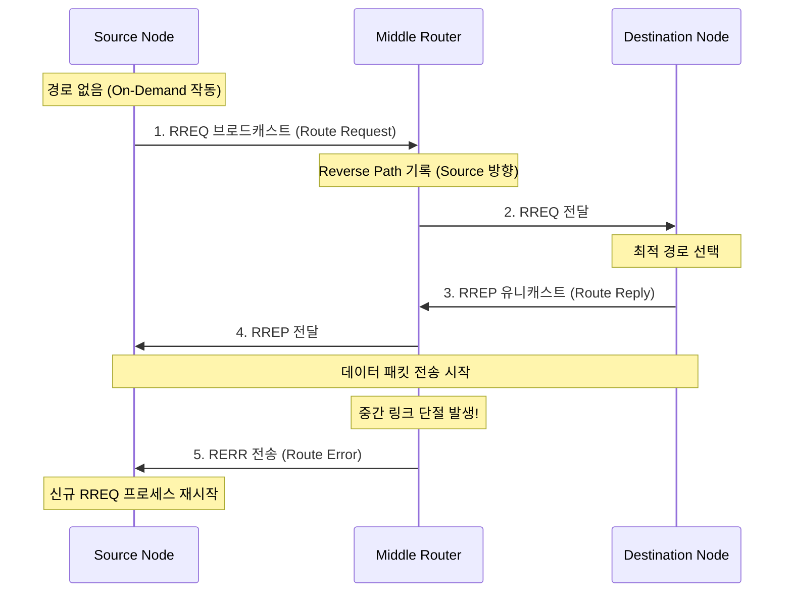

# 네트워크 개념

> **Context**: 방조제에서 진행한 Wi-Fi HaLow Line of Sight (LOS) 시험을 바탕으로 무선 통신 물리 계층(PHY)의 특성과 프로토콜 개념을 학습하고 정리한 문서.
> Wi-Fi HaLow 개발 UI(IP, Port 접근)를 활용해 1.5km ~ 5km 거리별로 AP와 Station 간 통신 성능을 직접 시험하였다. 국가 전파법 규정 내에서 Tx Power, Bandwidth Frequency 등을 조절하면서 RSSI, iperf로 측정한 패킷 지터, 유실률, 초당 전송량을 실시간 로그로 기록하며 전파의 특성과 네트워크 기초 지식을 체계화했다. 동일 경로 `concurrency` 디렉토리의 nsd 버그 data race 문서와 같이, 실제 필드 테스트 과정에서 파악된 무선 링크의 물리적 손실과 프로토콜 단위의 동작을 이론적으로 맵핑하여 정리하고자 작성되었다.

---

## 1. 전파의 물리적 특성

전파의 주파수와 파장의 관계는 다음과 같은 물리적 공식으로 정의된다.

$$\text{파장} (\lambda) = \frac{\text{광속} (c)}{\text{주파수} (f)}$$

$$\text{파장} (\lambda) \times \text{주파수} (f) = \text{광속} (c)$$

따라서 **주파수와 파장은 반비례**한다. 주파수가 높아질수록 파장의 길이는 짧아지며, 주파수가 낮아질수록 파장의 길이는 길어진다.

---

### Bandwidth (대역폭)

물리적 주파수 대역폭의 너비 (예: 1 MHz, 5 MHz, 20 MHz 등)를 의미한다.

- **국가별 규제**: 전파는 공공재이므로 국가마다 전파법에 따라 사용할 수 있는 주파수 대역과 채널별 최대 허용 대역폭이 엄격히 제한되어 있다. (예: Wi-Fi HaLow의 경우 국가별 Sub-GHz ISM 대역 규정이 다름)
- **좁은 대역폭 (Narrowband)**: 데이터 전송 속도가 느리지만 노이즈에 강하고 도달거리가 길다. 규제가 까다로운 국가나 장애물이 많은 환경에서 유리하다.
- **넓은 대역폭 (Broadband)**: 한 번에 많은 데이터를 보낼 수 있어 전송 속도가 빠르지만, 주파수 간섭을 받기 쉽고 전파의 전송 거리가 짧아진다.

---

### Symbol Rate (심볼 레이트)

1초당 공기 중으로 쏘아 보내는 신호(Symbol)의 개수이다. 

- 일반적으로 대역폭(Bandwidth)이 넓을수록 1초에 전송할 수 있는 물리적 심볼 레이트를 높일 수 있다.
- 하나의 심볼에 여러 비트(bit)의 데이터를 실어 나르는 방식(변조 방식)에 따라 실제 데이터 전송 속(bps)이 결정된다.

---

### 물리적 상관관계

| 구분 | 대역폭 및 심볼 레이트의 영향 | 주파수 및 파장의 영향 |
|---|---|---|
| **데이터 전송 속도** | 대역폭이 넓을수록, 심볼 레이트가 높을 수록 속도가 증가한다. | 주파수가 높을수록 비어 있는 넓은 대역폭을 확보하기 용이하여 고속 통신에 유리하다. |
| **통신 거리** | 심볼 레이트가 낮을수록 수신기가 에너지를 오래 누적하여 신호를 구분하므로 수신 감도가 향상되어 거리가 증가한다. | 주파수가 낮아 파장이 길수록 통신 거리가 증가한다. (경로 손실은 주파수의 제곱에 비례하여 커지기 때문) |
| **장애 대응** | 심볼 레이트가 낮을수록 무선 오염이나 반사파로 인한 Jitter가 발생해도 다음 심볼과 겹치는 간섭(ISI)이 적다. | 파장이 길수록 회절(Diffraction) 현상이 강하게 일어나 장애물을 돌파하거나 우회하는 능력이 향상된다. |

---

### 프레넬 존 (Fresnel Zone)

무선 통신 시 두 안테나 사이에서 전파가 주로 이동하는 축구공(타원체) 모양의 입체 공간이다.

```
                   프레넬 존 (Fresnel Zone)
                   . - - - - - - - - .
               .                       .
             /     _..---.---.._         \
  [AP] =====*==== (   지형/장애물 ) =====*==== [Station]
             \     `""---.---""`         /
               .                       .
                   ` - - - - - - - - `
```

지형이나 장애물에 의해 신호 하단부가 걸려 프레넬 존이 침범당하면 수신 전력이 정비례로 떨어진다. Line of Sight (LOS) 환경이라도 프레넬 존이 가려지면 전송 성능이 저하된다.

#### 해결 기법
- **소프트웨어 FEC (Forward Error Correction) 강도 상향**: 신호가 약해져 비트가 깨지더라도 수신기가 역산해서 복구할 수 있도록 패리티 비트(Parity Bit)를 무겁게 얹어 전송한다.
- **코딩 레이트 (Coding Rate) 조정**: 프레넬 존 부족으로 LQI가 떨어지면 코딩 레이트를 낮추어(예: 1/2 또는 3/4) 복구용 비트를 더 많이 추가해 복원력을 높인다.
- **패킷 조각화 동적 제어 (Dynamic Packet Fragmentation)**: 패킷이 통째로 날아가는 유실을 대비하여 MTU 크기를 평소의 1/4 수준으로 줄여서 짧은 패킷 여러 개로 쪼개어 보낸다. 패킷이 짧아지면 공기 중 점유 시간이 줄어들어 순간적인 노이즈를 피해 전송될 확률이 상승한다.
- **물리적 우회**: 지형 문제로 직접 통신이 완전히 불가능한 경우 메시 포워딩(Mesh Forwarding)을 적용하거나 중간에 라우터를 배치한다.

---

### 반사파 (Reflected Wave)

전파가 벽이나 장애물에 반사되어 들어오면 원래 신호와 수신부에서 겹치게 된다. 이로 인해 신호의 위상이 뒤틀려 특정 지점에서 신호가 상쇄되는 **Fading 현상**이 발생하거나, 먼저 보낸 심볼이 반사되어 늦게 도착하면서 다음 심볼과 겹치는 **심볼 간 간섭 (ISI, Inter-Symbol Interference)**이 유발된다.

#### 해결 기법
- **심볼 레이트 저하**: 심볼 사이의 시간 간격(Guard Interval)을 넓히기 위해 심볼 레이트를 낮춰 지연된 반사파가 다음 심볼을 침범하지 않도록 빈 시간을 확보한다.
- **적응형 호핑 스케줄러 (Adaptive Hopping Scheduler)**: 특정 주파수 대역이 간섭에 의해 상쇄(Multipath Fading)되었다면 해당 채널의 오염 여부를 실시간으로 파악하여 해당 대역을 회피하는 전략이다.
- **Software-driven Antenna Switching (안테나 다이버시티)**: 다중 안테나가 장착된 시스템에서 패킷의 프리앰블(Preamble)이 수신되는 마이크로초(µs) 단위 순간에 양쪽 안테나의 LQI를 빠르게 측정 및 비교하여, 더 깨끗한 신호가 들어오는 안테나로 하드웨어 경로를 스위칭한다.

---

### MCS (Modulation and Coding Scheme)

무선 전송 시 물리 계층(PHY)에서 채널의 상태에 맞춰 적용하는 **변조 방식(Modulation)**과 **코딩 레이트(Coding Rate)**의 조합 표이다.

- SNR이 좋고 채널 환경이 깨끗할 때는 고차 변조(예: 64-QAM, 256-QAM)와 높은 코딩 레이트(예: 5/6)의 높은 MCS 단계를 사용하여 전송 속도를 극대화한다.
- 거리가 멀어지거나 장애물로 인해 링크 품질이 악화되면 신호 복구율을 높이기 위해 저차 변조(예: BPSK, QPSK)와 낮은 코딩 레이트(예: 1/2)의 낮은 MCS 단계로 하향 조정(Fallback)한다.

---

### 공진 (Resonance)

안테나는 송신하고자 하는 특정 주파수의 전파와 물리적으로 공명을 일으켜 효율을 극대화한다.

- 안테나의 한쪽 끝에서 출발한 전류가 반대쪽 끝에 도달한 뒤 반사되어 돌아올 때, 처음 보낸 신호와 반사되어 돌아온 신호의 파형이 정확히 겹쳐서 보강 간섭을 일으키는 최적의 안테나 길이는 **파장의 1/4 지점 ($\lambda/4$)**이다.
- 정현파(Sine Wave)의 특성상 1/4 지점에서 위상이 $+1$로 최대 진폭을 형성한다.
- 이 주파수 파장 길이에 맞춰 안테나를 정밀하게 제작하면 내부에서 신호가 감쇄되지 않고 강한 전파가 외부로 뻗어나갈 수 있다. 이를 **Monopole 안테나**의 기본 원리라고 한다.

---

## 2. 무선 통신 성능 지표

무선 네트워크의 실제 링크 상태와 데이터 안정성을 판단하는 5대 핵심 지표다.

### RSSI (Received Signal Strength Indicator)

수신 장치가 감지한 무선 신호의 물리적인 세기를 의미하며, dBm 단위를 사용한다. $0\text{ dBm}$에 가까울수록 신호 세기가 강한 것이다.

- **-30 ~ -50 dBm**: 매우 우수한 수준 (Wi-Fi, 셀룰러가 공유기 바로 옆에 있을 때)
- **-40 ~ -55 dBm**: BLE/IoT 기기 간 거리가 1~2m 내외로 매우 가깝고 안정적인 상태
- **-70 ~ -80 dBm**: 연결 유지의 경계선. 패킷 드롭 및 재전송이 빈번하게 발생하기 시작하는 구간
- **-85 ~ -90 dBm**: 한계치. 프레임 손실(Frame Loss)이 심각하여 데이터 통신이 거의 불가능하거나 끊어지기 직전 상태

---

### SNR (Signal-to-Noise Ratio)

수신된 유효 신호의 세기(RSSI)와 주변 환경의 배경 노이즈(Noise Floor) 수준 사이의 상대적 비율을 뜻한다.

$$\text{SNR (dB)} = \text{RSSI (dBm)} - \text{Noise Floor (dBm)}$$

- 예: RSSI가 $-50\text{ dBm}$이고 주변 노이즈가 $-80\text{ dBm}$으로 측정된다면, SNR은 $30\text{ dB}$이다.

> **Q: dB와 dBm 단위의 차이는 무엇인가?**
> 
> - **dBm (Decibel-milliwatts)**: $1\text{ mW}$를 기준으로 한 **절대적인 물리적 전력 값**을 나타낸다. 
>   - 수치가 10 dBm씩 증가할 때마다 실제 전력(Watt)은 **10배** 증가한다.
>   - $3\text{ dBm}$ 차이는 실제 물리적 전력이 약 **2배** 정도 차이 남을 의미한다. (예: $0\text{ dBm} = 1\text{ mW}$, $3\text{ dBm} \approx 2\text{ mW}$)
> - **dB (Decibel)**: 두 값 사이의 비율을 나타내는 **상대적인 단위**다.
>   - "신호가 3 dB 커졌다"와 같이 전후 전력비나 신호 대 노이즈 비율을 나타낼 때 사용한다.
>   - 소리를 측정하는 데시벨(dB SPL)의 경우, 인간이 들을 수 있는 가장 작은 소리 압력($20\text{ }\mu\text{Pa}$)을 $0\text{ dB}$ 절대 기준선으로 잡고 상대값을 측정하는 특별한 경우다.

---

### LQI (Link Quality Indicator)

수신된 패킷의 전파 품질(왜곡 정도)을 $0 \sim 255$ (8비트) 범위의 숫자로 환산한 값이다. 단순히 신호의 강도(RSSI)만 보는 것이 아니라 신호의 오염 상태를 종합적으로 평가하므로, 통신 링크의 실질적인 건강 상태를 가장 정확히 대변한다.

> **Q: LQI는 구체적으로 어떤 체크리스트를 기준으로 산출되는가?**
> 
> LQI는 데이터 패킷 수신 시 하드웨어(RF 모뎀 칩) 단에서 수신 파형의 타이밍과 위상이 이상적인 신호와 비교해 얼마나 흐트러졌는지를 정밀하게 측정하여 매핑한 값이다. 
> 
> 1. **EVM (Error Vector Magnitude)**: 전파의 위상과 진폭을 좌표평면(Constellation Map) 상에 점으로 찍었을 때, 이상적인 좌표 점과 실제 안테나를 통해 들어온 물리적 수신 좌표 점 사이의 오차 거리(Error Vector)를 측정한다.
> 2. **Preamble & SFD 기반 분석**: 모든 무선 패킷의 전면부에 배치되는 고정 더미 패턴인 Preamble과 SFD(Start of Frame Delimiter)를 수신할 때의 전압 상승 폭(Rising Edge), 전류 안정화 시점, 비트 동기화(Clock Recovery) 일치율을 기준으로 계산한다.
> 3. **AI 기반 PHY / 채널 추정 (Channel Estimation)**: 최근 통신 칩셋은 아날로그 파형 오염 원인( Sagging 현상, 고주파 스파이크 노이즈, 접촉 불량 임피던스 반사파 등)을 기계 학습 모형을 통해 실시간 추정하여 LQI에 반영하기도 한다.

#### Python을 통한 EVM(Error Vector Magnitude) 계산 모사 시뮬레이션

EVM이 어떻게 계산되고 이것이 LQI의 소프트웨어적 기반이 되는지를 표현한 코드이다.

```python
import numpy as np

def calculate_evm(ideal_symbols: np.ndarray, received_symbols: np.ndarray) -> float:
    """
    수신된 복소 신호와 이상적인 신호 사이의 EVM(%)을 계산합니다.
    """
    # 오차 벡터 계산 (진폭과 위상 오차가 모두 반영됨)
    error_vectors = received_symbols - ideal_symbols
    
    # RMS 오차 전력
    rms_error = np.sqrt(np.mean(np.abs(error_vectors) ** 2))
    
    # 이상적인 신호의 RMS 전력
    rms_ideal = np.sqrt(np.mean(np.abs(ideal_symbols) ** 2))
    
    # EVM 백분율 산출
    evm_percent = (rms_error / rms_ideal) * 100
    return float(evm_percent)

# QPSK 기준 복소 평면 심볼 정의
ideal_qpsk = np.array([1+1j, -1+1j, -1-1j, 1-1j]) / np.sqrt(2)

# 노이즈와 위상 지터가 섞인 수신 심볼 모사
noise = (np.random.normal(0, 0.1, 4) + 1j * np.random.normal(0, 0.1, 4))
received_qpsk = ideal_qpsk + noise

evm = calculate_evm(ideal_qpsk, received_qpsk)
print(f"Estimated EVM: {evm:.2f}%")
```

---

### PER (Packet Error Rate) & BER (Bit Error Rate)

송신된 데이터 중 수신측에서 에러가 감지된 비율을 의미한다.

- **BER (Bit Error Rate)**: 전송된 전체 비트 중 깨진 비트의 비율.
- **PER (Packet Error Rate)**: 전송된 패킷 중 상위 레이어(L3/L4)에 도달하지 못하고 최종 유실된 패킷의 비율.
- **동적 제어**: 커널 드라이버에서 주기적으로 이 에러율을 모니터링하여, 특정 임계치를 초과하면 데이터 속도(MCS)를 낮추거나 다른 주파수 채널로 스위칭하는 알고리즘을 수행한다.

---

### CRC Error Count (Cyclic Redundancy Check)

데이터 링크 계층(L2)에서 수신 패킷의 체크섬 검증을 수행했을 때, 무선 노이즈 및 왜곡으로 인해 검증에 실패하여 드롭(Drop) 처리된 물리적 패킷의 누적 개수이다.

- **PER과의 차이**: CRC 에러 카운트는 물리 계층(PHY)에서 깨져서 들어와 버려진 모든 패킷의 절대적 수치이다. 반면 PER은 네트워크 레이어 레벨에서 재전송 시도까지 모두 감안한 후 최종적으로 실패한 비율을 뜻하므로 두 수치는 일치하지 않는다.
- 이 수치가 급격하게 상승한다면 현재 동작하는 채널 주파수 대역에 강력한 간섭 장비(Interference)가 작동하고 있음을 의미한다.

---

## 3. 무선 네트워크 프로토콜

IoT 및 저전력 무선 환경에서 사용되는 대표적인 프로토콜의 작동 원리와 차이점이다.

### Zigbee

저전력, 저용량, 저속 데이터 전송을 목표로 설계된 Mesh 네트워크 표준 프로토콜이다.

- **물리 계층**: IEEE 802.15.4 표준 규격을 기반으로 동작하며, 2.4 GHz ISM 밴드에서 5 MHz 대역폭을 가지는 16개 채널을 사용한다.
- **변조 방식**: DSSS(Direct Sequence Spread Spectrum)를 채택하여 노이즈 환경에서도 복구력이 우수하다.
  - **DSSS 원리**: 1비트 데이터를 송신하기 전에 송신기와 수신기가 미리 약속한 고속의 칩 시퀀스(Chip Sequence, 의사 난수열)를 XOR 연산하여 넓은 대역으로 분산 송신한다. 수신기는 수신한 신호를 동일한 칩 시퀀스로 역산하여 원래 비트를 복원한다. 전파가 넓게 퍼져 배경 노이즈처럼 보이기 때문에 도청이나 부분 재밍에 극도로 강하다.

#### Mesh 토폴로지와 AODV 라우팅 프로토콜

Zigbee 장치는 역할에 따라 세 가지 노드로 구분되며, 네트워크 내에서 서로 패킷을 릴레이하여 우회 경로를 생성한다.

```
                    [Coordinator] (최초 망 개설 및 경로 관리)
                         |
                 ┌───────┴───────┐
             [Router]        [Router] (패킷 중계 가능)
                 |               |
           ┌─────┴─────┐         |
    [End Device]  [Router] ──────┘
                       |
                 [End Device] (중계 기능 없음, Sleep 중심)
```

- **Coordinator (코디네이터)**: 네트워크를 최초로 개설하고 식별자(PAN ID)를 부여하며 라우팅 테이블을 관리한다.
- **Router (라우터)**: 자체 데이터를 송수신할 뿐만 아니라, 주변 노드가 보낸 패킷을 중계(Relay)하여 통신 거리를 확장한다.
- **End Device (엔드 디바이스)**: 센서 노드와 같이 송수신 기능만 가지며 중계 기능은 수행하지 않는다. 평소에는 깊은 잠(Sleep Mode)에 들어 배터리를 절약한다.

##### AODV (Ad-hoc On-demand Distance Vector) 작동 프로세스
노드가 물리적으로 이탈하거나 배터리가 방전되어 경로가 단절되면 AODV 프로토콜을 통해 실시간으로 우회 경로를 동적으로 탐색한다.



---

### BLE (Bluetooth Low Energy)

2.4 GHz ISM 밴드를 사용하는 저전력 근거리 무선 표준이다.

- **주파수 채널 구조**: 2.402 GHz ~ 2.480 GHz 대역을 2 MHz 간격의 40개 채널로 쪼개어 사용한다.
  - 3개의 **Advertising 채널** (장비 탐색 및 페어링용)
  - 37개의 **Data 채널** (실제 데이터 양방향 전송용)
- **FHSS (Adaptive Frequency Hopping)**: 주변 Wi-Fi 신호나 노이즈가 없는 깨끗한 채널을 모니터링하여, 정해진 홉 시퀀스에 따라 37개 데이터 채널 사이를 초당 수십~수백 번씩 빠르게 변경하면서 통신한다.
- **안테나 크기 결정 이론**:
  - 주파수 $2.4\text{ GHz}$의 파장 길이는 약 $12.5\text{ cm}$ 이다.
  - 전파 공진 효율이 높은 안테나 크기는 파장의 1/4 ($\lambda/4$)이므로, 안테나의 최적 길이는 약 **3.1 cm**이다. 스마트 워치나 웨어러블 디바이스 내부에 탑재되는 안테나 크기의 물리적 근거가 된다.

#### 1 Mbps vs 2 Mbps PHY 및 Fallback 메커니즘

블루투스 5.0부터 지원하는 2 Mbps 고속 전송 모드와 기존 1 Mbps 모드는 하드웨어 및 소프트웨어적으로 다음과 같은 특징을 가진다.

| 구분 | 1 Mbps (BLE 1M PHY) | 2 Mbps (BLE 2M PHY) |
|---|---|---|
| **물리적 대역폭** | 1 MHz (GFSK 변조) | 1 MHz (GFSK 변조) |
| **심볼 레이트** | 1 Msym/s | 2 Msym/s (Symbol Duration 절반 축소) |
| **소모 전력** | 상대적으로 높음 (공기 중 송신 대기 시간이 긺) | **30~40% 절감** (패킷 전송을 2배 빠르게 끝내고 Sleep 돌입) |
| **노이즈 내성** | 우수함 (심볼 폭이 넓어 지터와 왜곡에 강함) | 취약함 (심볼 폭이 좁아 노이즈 영향이 큼) |
| **전송 거리** | 상대적으로 김 | 20~30% 감소 (수신 감도 한계가 높음) |

- **Fallback (다운그레이드) 프로세스**:
  1. 기기가 2 Mbps 모드로 전송 중 거리가 멀어지거나 방해물로 인해 RSSI/LQI가 손상되어 패킷 에러율(BER)이 임계치 이상으로 급증한다.
  2. 링크 계층(Link Layer)에서 상대 기기에 `LL_PHY_REQ` 제어 패킷을 송신하여 통신 속도를 1 Mbps로 낮출 것을 제안한다.
  3. 상대측이 `LL_PHY_RSP`로 응답하면, 다음 연결 이벤트(Connection Event) 시점에 양측 모뎀 칩의 레지스터를 변경하여 1 Mbps 모드로 안전하게 폴백한다.
  4. 이후 무선 환경이 개선되어 RSSI가 기준치 이상으로 복구되면 다시 2 Mbps 모드로 스케일업(Scale-up)을 진행한다.

#### Zephyr RTOS의 사용자 지정 적응형 채널 맵 업데이트 모사 (C언어)

모뎀 칩셋 컨트롤러 커널 레벨에서 오염 채널을 스캔하고 실시간으로 채널 맵에서 제외하는 적응형 FHSS 로직을 모사한 구현 예시이다.

```c
#include <stdint.h>
#include <stdbool.h>

#define BLE_DATA_CHANNELS 37
#define RSSI_NOISE_THRESHOLD -75 // 이 값보다 노이즈 플로어가 높으면 오염 채널로 판단

// 실제 하드웨어 RSSI 스캔 및 채널 맵 갱신 구조
void update_adaptive_channel_map(void) {
    // 37개 데이터 채널 활성화 비트맵 (5바이트, 40비트 공간 중 37비트 사용)
    uint8_t custom_chmap[5] = {0xFF, 0xFF, 0xFF, 0xFF, 0x1F}; 
    
    for (int ch = 0; ch < BLE_DATA_CHANNELS; ch++) {
        // 해당 채널의 배경 노이즈(Noise Floor) 강도를 스캔
        int16_t noise_floor_rssi = read_channel_noise_floor(ch);
        
        if (noise_floor_rssi > RSSI_NOISE_THRESHOLD) {
            // 노이즈가 너무 높은 채널은 비트맵에서 0으로 클리어 (채널 차단)
            custom_chmap[ch / 8] &= ~(1 << (ch % 8));
            log_warn("Channel %d blocked due to high noise floor: %d dBm", ch, noise_floor_rssi);
        }
    }
    
    // BLE 컨트롤러 Link Layer에 변경된 채널 맵 적용 명령 전달
    ble_controller_set_channel_map(custom_chmap);
}
```

---

### Classic Bluetooth vs BLE 비교

두 프로토콜은 2.4 GHz 대역을 공유하는 것을 제외하고는 프레임 규격 및 물리 구조가 완전히 다른 프로토콜이다.

| 구분 | Classic Bluetooth (클래식 블루투스) | BLE (Bluetooth Low Energy) |
|---|---|---|
| **주요 목적** | 대용량 데이터의 지속적인 스트리밍 (음성, 음악 등) | 간헐적인 소량 데이터 전송 및 배터리 극대화 (센서, 제어 등) |
| **채널 구성** | 1 MHz 대역폭 $\times$ 79개 채널 | 2 MHz 대역폭 $\times$ 40개 채널 |
| **연결 방식** | Connection-Oriented (페어링 상태를 상시 유지) | Connectionless / Fast Connect (송신 시에만 순간 연결 후 해제) |
| **전력 소모** | 높음 (연속 전송 구조) | 극도로 낮음 (평소 Deep Sleep 상태 유지) |

---

*2026-06-16*
