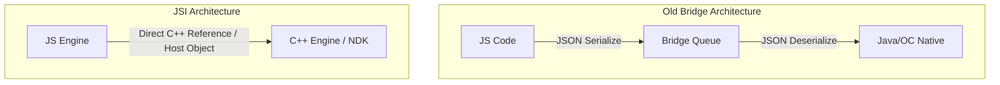

# JSI & Zero-Copy 아키텍처

> **React Native 환경에서 호출 오버헤드를 낮추는 JSI 기술과 데이터 복사 비용을 없애는 Zero-Copy 설계를 통합하는 고성능 비전/미디어 플랫폼 아키텍처**

---

## 1. JSI (JavaScript Interface): 호출 경계 최적화

기존 React Native Bridge와 차세대 JSI 구조의 근본적인 차이는 **호출 경계(Call Boundary)**의 직렬화 여부에 있습니다.

### JSI의 본질
*   **Old Bridge**: JS와 네이티브 간 통신 시 데이터를 JSON 문자열로 인코딩(직렬화)하고 비동기 메시지 큐에 태운 뒤, 반대편에서 디코딩(역직렬화)하는 구조로 인해 고빈도 호출 시 레이턴시가 폭증했습니다.
*   **JSI (New Architecture)**: C++ 객체를 JS 내부의 **`HostObject`** 또는 **`HostFunction`** 형태로 다이렉트 바인딩합니다. JS 엔진이 네이티브 C++ 함수/객체의 메모리 주소를 직접 참조하여 네이티브 C++ 함수를 동기적으로 직접 실행(Call)합니다.

> [!IMPORTANT]  
> **JSI는 자동 Zero-Copy가 아닙니다.**  
> JSI는 **호출 경계**의 오버헤드를 제로로 만드는 기술일 뿐, 대용량 버퍼나 이미지 데이터를 인자로 넘기면 여전히 C++와 JS 메모리 사이에서 복사가 발생합니다. 진정한 성능 극대화를 위해서는 JSI 상단에 **Zero-Copy Payload 설계**가 추가로 얹어져야 합니다.

---

## 2. Zero-Copy: 페이로드 전송 최적화

Zero-Copy의 핵심은 데이터가 최초에 메모리에 할당(디스크 읽기, 디코딩, 센서 측정 등)된 이후, 다른 레이어나 스레드로 넘어갈 때 발생하는 **추가 메모리 복사 및 재할당 연산을 원천 차단**하는 데 있습니다.

### Zero-Copy API 설계 패턴
1.  **Arena Allocator**: 연속적인 메모리 페이지 블록을 미리 확보하고 오프셋을 쪼개어 할당하는 C++ Arena 구조를 구축하여 단편화(Fragmentation)와 OS 메모리 오버헤드를 방지합니다.
2.  **포인터 & 메타데이터 공유**: 대용량 바이너리(예: 10MB Raw 비디오 프레임)는 공유 메모리 영역에만 유지합니다. JS/JSI 경계에서는 실제 바이너리를 카피하여 반환하는 것이 아니라, `handle / offset / length / shape / stride`와 같은 가벼운 메타데이터 구조체만 JSI를 통해 동기적으로 즉시 넘겨줍니다.
3.  **WASM SAB 연계**: Web의 경우 `SharedArrayBuffer`와 `Atomics` 조합을 활용해 이 Arena 버퍼를 복사 없이 멀티스레드로 동기화하여 처리합니다.

---

## 3. Web & Android 고성능 통합 보안 규격

### A. COOP & COEP (Cross-Origin Isolation)
공유 메모리(`SharedArrayBuffer`)의 강력한 성능 뒤에는 스펙터(Spectre)와 같은 CPU 사이드채널 공격 리스크가 따릅니다. 이를 차단하기 위해 브라우저는 엄격한 교차 출처 격리(Cross-Origin Isolation) 응답 헤더 설정을 강제합니다.
*   `Cross-Origin-Opener-Policy: same-origin` (COOP)
*   `Cross-Origin-Embedder-Policy: require-corp` (COEP)
이 헤더들이 존재해야만 JS 런타임에서 SharedArrayBuffer 생성이 정상 허용됩니다.

### B. Emscripten WASM 빌드 파이프라인
*   C++ 소스([maglev_core.cpp](file:///mnt/d/agentproject/wasm-native-bridge/src/maglev_core.cpp))를 컴파일러를 통해 WASM 바이너리로 빌드합니다.
*   빌드 시 C++ 내보내기 함수(`EMSCRIPTEN_KEEPALIVE`)를 정의하고, 메모리 내보내기(`-sEXPORTED_RUNTIME_METHODS`) 및 스레드 지원(`-pthread`) 플래그를 통해 WASM 인스턴스의 힙 영역을 `SharedArrayBuffer`로 직접 내보내어 JS와 1:1 메모리 매핑을 형성합니다.

### C. Android IPC로의 확장 (3단계 연계)
Android OS 멀티프로세스 환경에서는 JSI 단일 프로세스 경계를 넘어 독립 서비스 간의 통신이 필요합니다.
*   **AIDL / Binder**: 프로세스 간 메시징 및 RPC를 구현하기 위한 표준이나, Binder 트랜잭션 제한(1MB)으로 대형 페이로드 전송은 차단됩니다.
*   **SharedMemory**: 안드로이드의 `Ashmem(Anonymous Shared Memory)` 파일 디스크립터(FD)를 Binder로 한 번만 전달하면, 서로 다른 두 프로세스가 커널 영역의 동일 메모리 공간을 공유하여 무복사(Zero-Copy) 초고속 데이터 홉을 달성합니다.

---

## 4. 마샬링, 직렬화, JSON 직렬화의 관계

프로세스, 런타임, 스레드 경계를 넘어 데이터를 전달하는 기술적 행위는 아래와 같은 계층 구조(포함 관계)를 가집니다.

$$\text{마샬링 (Marshalling)} \supset \text{직렬화 (Serialization)} \supset \text{JSON 직렬화 (JSON Serialization)}$$

1.  **마샬링 (Marshalling)**: 서로 다른 메모리 영역이나 다른 언어 런타임 간에 데이터를 올바르게 해석할 수 있도록 특정 포맷으로 변환하고 전달하는 행위 전반을 지칭합니다. (메모리 포인터 전달 및 원격 객체 바인딩 등도 마샬링에 포함됩니다.)
2.  **직렬화 (Serialization)**: 마샬링의 하위 집합으로, 구조화된 복합 객체를 일련의 바이트 스트림(Byte Stream)이나 문자열로 플래시(flatten)하는 행위입니다.
3.  **JSON 직렬화**: 직렬화 스트림을 인간이 읽을 수 있는 텍스트 기반 JSON 파일 형식으로 포맷팅하는 가장 구체적인 구현 방식 중 하나입니다. (기존 RN Bridge가 채택하여 오버헤드를 유발하던 지점입니다.)
4.  **JSI의 의의**: JSI는 이 마샬링 과정에서 발생하는 직렬화/역직렬화 비용을 원천 제거하고, C++ 포인터를 통한 직접 바인딩(Call Boundary Optimization)을 실현합니다.

---

## 5. 핵심 오개념 교정 요약

| 기존 오개념 | 교정된 올바른 이해 |
| :--- | :--- |
| **SAB 공유를 권한 부여나 큐 대기로 오해** | 양쪽 스레드가 실제 동일한 물리 메모리 페이지를 가리키는 **두 번째 참조(핸들)**를 갖게 되는 것 (mmap 매핑과 유사) |
| **Atomics.wait/notify 없이 polling/Promise로 충분함** | Polling은 CPU 자원을 태우는 Busy-wait 유발, Promise/콜백은 이벤트 루프의 태스크 큐에 종속되어 실시간 메모리 변경을 전파받지 못하므로 wait/notify 스레드 스케줄러 동기화가 필수적임 |
| **JSI = Zero-Copy 아키텍처** | JSI는 함수 호출 마샬링 제거(호출 경래 최적화) 기술이고, Zero-Copy는 복사를 생략하는 페이로드 전송 최적화로 **서로 다른 독립된 축**임 |
| **마샬링과 JSON 직렬화는 동의어** | 마샬링이 통신 경계를 넘기는 행위 전반을 의미하는 가장 넓은 범위의 개념이며, JSON 직렬화는 이를 수행하는 하부 구현체 중 하나임 |

