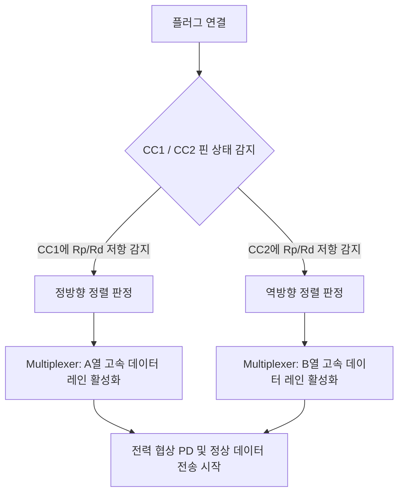

# USB Type-C 인터페이스의 물리 계층 동작 원리와 다계층 디버깅 기법

이 문서는 USB Type-C 커넥터의 180도 회전 대칭 작동 원리, CC(Channel Configuration) 핀 기반의 방향 감지 및 능동 스위칭, 슈퍼스피드(SuperSpeed) 레인 구조, 물리적 열화에 따른 신호 감쇠 현상 및 하드웨어-소프트웨어 경계 영역에서의 다계층 디버깅 방법론을 기술합니다.

---

## 1. 24핀 회전 대칭 구조 (180-Degree Rotational Symmetry)

USB Type-C 커넥터는 사용 편의성을 위해 플러그를 어느 방향(위/아래)으로 꽂아도 동일하게 동작하도록 설계되었습니다. 이를 위해 리셉터클(Receptacle)과 플러그(Plug)의 핀 배치는 **180도 회전 대칭(Rotational Symmetry)** 구조를 가집니다.

### A. 핀 맵 (Pinout Map)

USB Type-C 리셉터클은 A열(상단) 12개, B열(하단) 12개로 총 24개의 핀으로 구성됩니다.

```
[A열]  GND  TX1+ TX1- VBUS CC1  D+   D-   SBU1 VBUS RX2- RX2+ GND (A1~A12)
       |    |    |    |    |    |    |    |    |    |    |    |
       |    |    |    |    |    |    |    |    |    |    |    |  <- 180도 회전 대칭
       |    |    |    |    |    |    |    |    |    |    |    |
[B열]  GND  RX1+ RX1- VBUS SBU2 D-   D+   CC2  VBUS TX2- TX2+ GND (B12~B1)
```

* **대칭 쌍**:
  * $A_1$ (GND) $\leftrightarrow$ $B_{12}$ (GND)
  * $A_4$ ($V_{BUS}$) $\leftrightarrow$ $B_9$ ($V_{BUS}$)
  * D+/D- USB 2.0 차동 신호선은 중앙($A_6/A_7$, $B_7/B_6$)에 위치하여 회전하더라도 동일한 신호선끼리 접촉하도록 배치되어 있습니다.

---

## 2. CC (Channel Configuration) 핀의 비대칭 감지 및 능동 스위칭

회전 대칭 구조이지만, 실제로 동작을 설정하는 **CC(Channel Configuration)** 핀과 고속 데이터 전송을 위한 **슈퍼스피드(SuperSpeed) 레인**은 비대칭성을 가지고 있습니다. 이 비대칭성 덕분에 방향을 식별하고 적합한 신호 라우팅을 수행할 수 있습니다.

### A. CC 핀의 역할과 결합 스키마
* 리셉터클에는 **CC1($A_5$)**과 **CC2($B_5$)** 두 개의 CC 핀이 있습니다.
* 그러나 USB Type-C 표준 케이블 내부에는 **단 한 개의 CC 라인**만 관통합니다. (반대쪽 핀은 $V_{CONN}$으로 케이블 내 IC 전원 공급용으로 쓰이거나 더미 상태임)



### B. 감지 메커니즘 (Source & Sink)
1. **Source (호스트, DFP)**: CC 핀에 Pull-up 저항($R_p$) 또는 전류 소스를 걸어둡니다.
2. **Sink (디바이스, UFP)**: CC 핀에 Pull-down 저항($R_d$ = 5.1k$\Omega$)을 연결해 둡니다.
3. 플러그가 삽입되면 양 끝단의 컨트롤러(CC Controller/PD Controller)는 어떤 CC 핀에서 전압 강하가 발생하는지 측정합니다.
   * **CC1** 전압 변화 감지 $\rightarrow$ 정방향(Right-side Up) 삽입 판정
   * **CC2** 전압 변화 감지 $\rightarrow$ 역방향(Upside Down) 삽입 판정
4. 방향 판정이 완료되면, 물리적인 **Multiplexer(Mux) 칩셋**이 작동하여 데이터 차동 신호선(TX/RX)과 SBU(Sideband Use) 핀의 라우팅 방향을 해당 CC 핀에 맞게 동적으로 전환합니다.

---

## 3. 슈퍼스피드 레인 (SuperSpeed Lanes)과 신호 무결성

USB 3.x 이상 사양에서 사용되는 슈퍼스피드(SuperSpeed) 레인은 고속 차동 신호 쌍으로 구성되며, A열과 B열에 각각 존재합니다.

* **TX1+/TX1-, RX1+/RX1-** (A열 고속 레인)
* **TX2+/TX2-, RX2+/RX2-** (B열 고속 레인)

플러그 방향에 따라 컨트롤러가 2개 채널 중 하나만 활성화하거나(10Gbps 단일 레인 동작), 양방향 레인을 모두 결합하여 최대 20Gbps/40Gbps(듀얼 레인 동작)를 구현합니다.

### A. 저가형 커넥터 및 케이블의 한계점
* **방향 감지 오동작**: 저가형 커넥터의 경우 CC 핀의 저항 오차 또는 기계적 접촉 불량으로 인해 방향 감지 자체가 불안정하여 전력 공급 협상(PD)이 실패하거나 USB 2.0으로 하향 조정(Fallback)될 수 있습니다.
* **SuperSpeed 미배선**: 충전 전용 또는 저가형 USB 2.0 C타입 케이블은 슈퍼스피드 핀($A_2, A_3, A_{10}, A_{11}$ 및 B열 대칭 핀)이 아예 케이블 내부에 배선되어 있지 않아 고속 데이터 통신이 불가능합니다.

### B. 신호 감쇠 및 무결성(Signal Integrity) 문제
고부하 상황(5Gbps 이상의 초고속 데이터 전송 및 Power Delivery 고전류 송전)에서는 케이블의 물리적 노화나 차폐(Shield) 설계 부실로 인해 다음과 같은 현상이 발생합니다.

$$\text{전압 강하 } (V_{drop}) = I \times R_{cable}$$

1. **임피던스 불연속성**: 커넥터 접촉부 마모나 낡음으로 인해 고속 차동 신호의 특성 임피던스(통상 90$\Omega$)가 무너져 반사 손실(Reflection) 및 지터(Jitter)가 증가합니다.
2. **누설 전류와 노이즈**: 차폐 피복의 미세 단선이나 산화로 외부 노이즈(EMI/RFI) 유입이 심화되어 패킷 에러율(BER)이 급증합니다.
3. **전압 강하**: 부하 전류가 높을 때 저항 증가로 전압 강하가 발생, 기기 오동작이나 연결 해제를 유발합니다.

---

## 4. 하드웨어-소프트웨어 경계 레이어에서의 디버깅 인사이트

안드로이드 디바이스 개발 및 ADB 디버깅 시 **"어제까지는 멀쩡하게 동작하던 통신이 오늘은 안 되는"** 물리적 불안정 상황은 모바일 커넥터 마모, 포지션 별 접촉 압력 차이, 케이블 내부 단선 등에 기인하는 경우가 매우 많습니다. 

이러한 물리적 오동작이 소프트웨어 레이어로 전파되면 예기치 못한 커널 드라이버 다운이나 소켓 타임아웃, ADB 연결 유실 등으로 나타납니다.

### A. 이분 탐색(Binary Search) 기반 장애 격리 방법론
복잡한 전송 시스템(물리 커넥터 $\rightarrow$ 드라이버 $\rightarrow$ 시스템 프로토콜 $\rightarrow$ 애플리케이션)에서 장애 원인을 가장 신속하게 격리하는 방법은 **다계층 모델의 중간 지점부터 검증해 나가는 이분 탐색 기법**입니다.

```mermaid
sequenceDiagram
    participant HW as [Layer 1] 물리/전기적 계층
    participant Link as [Layer 2] 링크/드라이버 계층
    participant Prot as [Layer 3] 프로토콜 계층 (ADB/Socket)
    participant App as [Layer 4] 애플리케이션/비즈니스 계층

    Note over Link, Prot: 1단계: 중간 경계면 검증 (예: 커널 dmesg / lsusb 확인)
    alt Link/Prot 경계 정상
        Note over Prot, App: 상위 레이어로 이분 탐색 범위 좁힘
    else Link/Prot 경계 비정상
        Note over HW, Link: 하위 레이어(물리 커넥터, 전압 강하 등)로 범위 좁힘
    end
```

1. **중간 레이어 분석(1단계)**: 시스템 커널 로그(`dmesg`)나 USB 장치 드라이버 정보(`lsusb`, `adb devices`)를 조회하여 OS 수준에서 USB 장치 연결 이벤트가 감지되는지 검증합니다.
2. **하향 격리(OS 미감지 시)**: 
   * CC 컨트롤러 및 전압 강하 측정(물리적 전력 수급 여부).
   * 커넥터 방향을 180도 돌려서 재연결(한쪽 CC 레인 불량 격리).
   * 케이블 교체 및 부하 수준 축소(신호 무결성/전압 강하 격리).
3. **상향 격리(OS 감지되나 통신 실패 시)**:
   * TCP/IP 소켓 상태 확인 및 ADB 프로토콜 핸드셰이크 패킷 덤프.
   * 무선/유선 브릿지 전송 시 발생하는 임피던스 불일치 및 간섭 노이즈 조사.

---

## 5. 전자공학적 이해의 소프트웨어적 확장 (ASIC/PCB 디버깅 연계)

ASIC 칩셋과 PCB 회로로 설계된 정밀 제어 디바이스(예: 전자뇌관 제품)의 경우, 소프트웨어 타이밍 제어와 전기적 거동이 한 몸처럼 움직입니다. 임베디드 및 시스템 소프트웨어 개발자는 다음과 같은 하드웨어 First Principles를 체계적으로 이해해야 고난도 디버깅이 가능합니다.

| 전기/하드웨어 개념 | 소프트웨어적 영향 및 대응 방식 |
|---|---|
| **임피던스 매칭 (Impedance Matching)** | 송수신 단자 임피던스가 맞지 않으면 신호 반사가 일어나 고속 비트열 전송 시 데이터가 왜곡됩니다. 드라이버 단에서 슬루 레이트(Slew Rate)를 조절하거나 패킷 길이를 제한해 대응합니다. |
| **커패시터 싱크 (Capacitor Sinking)** | 뇌관 충방전 회로의 커패시터가 에너지를 흡수하거나 방전할 때 스파이크 전류가 튀어 MCU 전압이 드롭될 수 있습니다. 펌웨어 레벨에서 고전력 로드를 온/오프할 때 듀티 사이클(Duty Cycle)을 서서히 조절(Soft Start)해야 합니다. |
| **풀업/풀다운 저항 및 노이즈** | 플로팅(Floating) 상태의 핀은 주변 전자기 노이즈에 의해 무작위 인터럽트를 유발합니다. 소프트웨어에서 내부 풀업/풀다운 레지스터를 명확히 활성화하고, 디바운스(Debounce) 알고리즘을 튜닝합니다. |
| **유/무선 브릿지 간섭** | 물리적 전송 선로의 노이즈 차단력 차이로 유선 대비 무선 브릿지에서 패킷 유실률이 치솟습니다. 전송 계층 프로토콜 설계 시 데이터 크기에 비례하는 슬라이딩 윈도우 조절 및 재전송 메커니즘을 동적으로 대처해야 합니다. |
